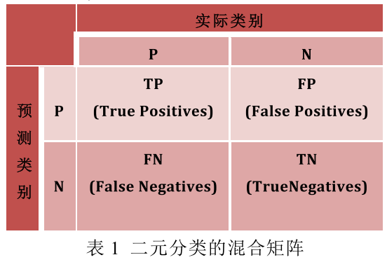

制定有效的不平衡学习的评估指标, 是实践中可行性的关键和保障.

## 混淆矩阵系列

传统的方法即计算precision/recall.

$$precision=\frac{TP}{TP+FP}$$

$$recall=\frac{TP}{TP+FN}$$

还有准确率和错误比例:

$$accuracy=\frac{TP+TN}{P+N}$$

$$errorRate=1-accuracy$$

更适应不平衡数据的评估指标例如:

$$F-Measure=\frac{(1+\beta)^2\cdot{precision}\cdot{recall}}{\beta^2\cdot{recall}+precision}$$

F-Measure通过参数$$\beta$$调整Precision和Recall在不同应用背景下的比重以适应.

另一种权衡函数**G-mean**对类别的不平衡不敏感, 使用与不平衡场景.

$$G-mean=\sqrt{\frac{TP}{TP+FN}\times\frac{TN}{TN+FP}}$$

## ROC-curve图, AUC

ROC(Receiver Operating Characteristics)依赖于混淆矩阵. 首先定义:

$$T P_\_ \text { rate }=\frac{T P}{P}$$

$$F P_\_ r a t e=\frac{F P}{N}$$

ROC图中, FP_rate作横坐标, TP_rate为纵坐标, 每个点(FP_rate, TP_rate)都代表当前分类器在给定的类别分布数据集上的分类表现.

当分类算法的输出是离散的类别值时, 每个分类器会产生一对(TP_rate, FP_rate)

- $$A(0,1)$$是最理想分类器的表现. 分类器某次分类性能的优劣与其在ROC中对应点距A点远近成正比.
- 分布在对角线上的点, 如E, 代表随机预测的分类器
- 分布于ROC图右下方的点所代表分类器性能比随机预测更差

当分类器的输出一系列多对(FP_rate, TP_rate)时, ROC图中形成一条曲线. 这种情况下, 引入新的评估参数: AUC(arear under the curve), 即当前曲线右下方面积, 来描述分类器的性能, AUC 越大性能越优. 这一系列的(FP_rate, TP_rate)是通过设置不同的分类**阈值**得到的.

## PR-curve图

但ROC图在评估高度不平衡的数据集时, 对分类算法性能的评估过优, 而这一问题可以通过信息含量更大的PR(Precision-Recall)曲线解决.

PR曲线以recall为横坐标, precision为纵坐标. PR图几乎包括了ROC图所能表现的所有特征, 而且较之于ROC提供了更丰富的信息, **也更加适应不平衡分类问题背景**.

当分类器在不同类分布条件下的FP有巨大变化时, 由于N数值较大, ROC的FP_rate几乎不会有显著改变, 也就无法捕捉这一种变化情况. 由于PR的precision考虑TP+FP, FP的变化很容易从precision中展现出来.

因此在高度不平衡分类问题中, PR比ROC更能适应实际情况, 被研究者们广泛采用为评估与分析的重要方式.
