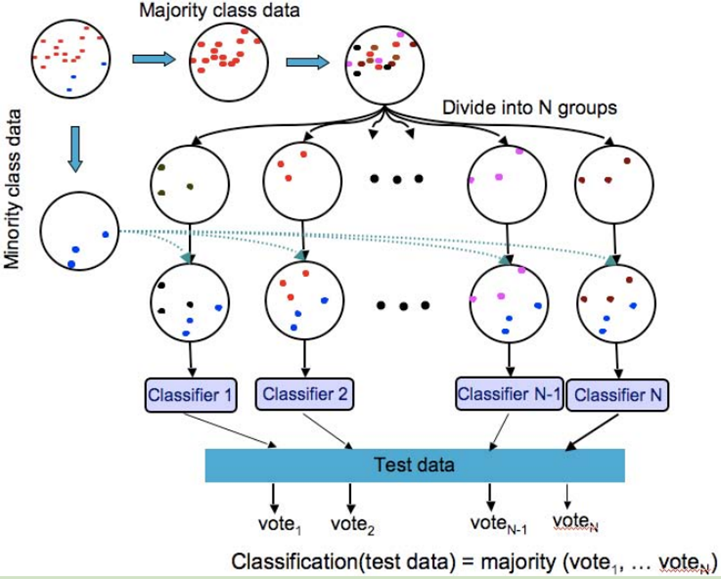
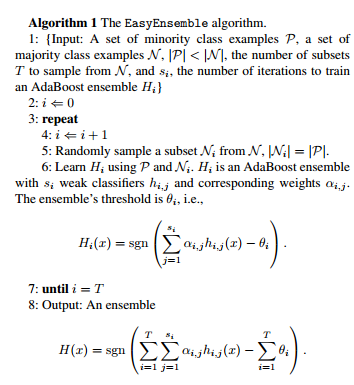
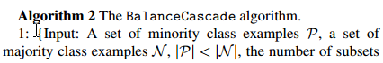
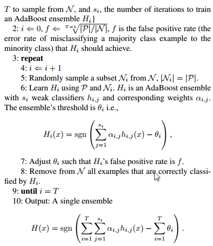

## Undersampling + Ensemble

对不平衡数据集进行欠采样, 意味着模型只能观察到很少的多数类信息(数百甚至数千分之一), 信息损失会很严重, 而且难以保证采集到的都是含有较多信息的数据点. 因此, **较低的采样率**带来**randomness**, 即多次随机采样训练得到的学习器之间有很大的差别.

当IR比较低的时候, 一个简单的结合ensemble的方法是**bagging**.  例如IR=10时, 可以将多数类随机的划分成10份, 来保证使用数据中的全部信息. 训练10个模型, 然后使用mean/voting的方法得到最终的结果.

但在extremely imbalance的情况下, 这种方法就不可行了:

- 为了使用全部的信息, 需要训练超多的模型, 可能需要大量的时间和资源
- 采样率太低, 导致随机性太强, 若干模型中可能只有极少数的模型work

## EasyEnsemble

EasyEnsemble就是上述方法具体实现.

整个算法的过程如下图:

算法伪代码如下:

easy ensemble每次从多数类中抽样出和少数类数目差不多的样本, 然后和少数类样本组合作为一个子训练集, 第$$i$$次得到的训练集记为$$H_i$$.

然后对于每个训练集, 训练得到一个分类器. EasyEnsemble中使用的是Adaboost算法. 最后预测的时候, 是使用之前学习到的所有Adaboost中的弱分类器与阈值.

注意这里的每个Adaboost模型输出都会有一个偏差$$\theta_i$$, 这个参数也是通过学习得到的.

## Balance Cascade

参考论文[Exploratory Undersampling for Class-Imbalance Learning](https://cs.nju.edu.cn/zhouzh/zhouzh.files/publication/tsmcb09.pdf).

BalanceCascade算法是一种结合了模型训练的**欠采样**方法, 即其本质是一种采样方法. 论文中使用了与EasyEnsemble一样的Adaboost学习器进行训练, 这里的学习器可以代替为任意分类器, 例如在`imblearn`算法包中, 默认是使用KNN这种简单的分类器.

BalanceCascade算法的伪代码如下:

多数类样本记为$$N$$, 少数类样本记为$$P$$. 一共从$$N$$中采样$$T$$次, 因此有$$T$$个子训练集, 对于第$$i$$次迭代, 训练得到的Adaboost模型为$$H_i$$, 每个模型包含$$s_i$$个弱学习器.

在第7步, 需要调整当前步的分类器的分界阈值$$\theta_i$$, 使得训练好的$$H_i$$模型在当前子训练集上的**误检率**(flase positive rate)为$$f$$:

$$f=(\frac{|P|}{|N|})^{\frac{1}{N-1}}$$

flase positive rate定义为: $$\frac{FP}{FP+TN}$$. 此处我们认为少数类样本为正样本.

然后, 单独使用这个$$H_i$$模型对所有的多数类样本进行预测, 将所有预测正确的样本从负样本集合中剔除. 由于在确定阈值$$\theta_i$$时的flase positive rate为$$f$$, 因此每个Adaboost模型会有$$1-f$$比例的多数类样本被剔除. 而在迭代$$T-1$$次之后, 多数类样本就还剩余$$|N|\cdot{f^{T-1}}=|P|$$个了, 两类样本数量完全一致, 停止迭代.

最后的输出如EasyEnsemble模型一样, 也是将所有的模型输出进行投票/平均, 得到最后的结果.

## 参考资料

- [Exploratory Undersampling for Class-Imbalance Learning](https://cs.nju.edu.cn/zhouzh/zhouzh.files/publication/tsmcb09.pdf).
- [easy ensemble 算法和balance cascade算法](https://blog.csdn.net/march_on/article/details/48656391?locationNum=6&fps=1)
