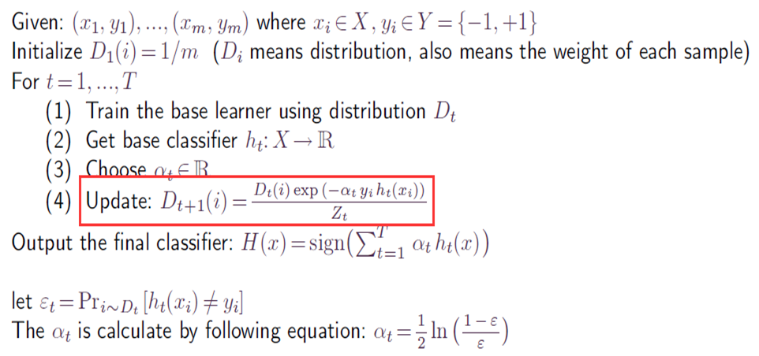
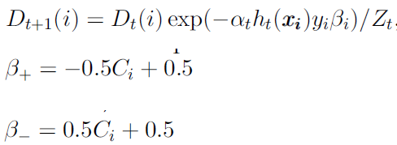

## Cost-based Sampling

作者指出可以通过**cost-based采样**样使得分类算法具有一定的cost-sensitive. 要使得分类算法对于cost较高的那一类数据的敏感性高于另一类.

通过不同的方法确定每个类别的采样比例, 这个比例是与cost matrix相关的.

## MetaCost

MetaCost是一种reweighted算法, MetaCost的基本思想是根据cost最优分类为训练数据集上的实例进行重标记, 然后对重新标记的样本重新进行训练, 而获得目标非cost-sensitive分类算法的对应的cost-sensitive分类算法.

由$$L(\mathbf{x},i)=\sum\limits_{j}P(j|\mathbf{x})c(i,j)$$可知, 为了达到最优的分类, 我们需要获得每个class的预测分类概率$$P(j|\mathbf{x})$$.

- 通过运行在若干个原训练集的重采样子集之上的若干个目标分类算法的组合
- 获得目标分类算法在训练集上的预测分类概率$$P(j|\mathbf{x})$$, 这里是一种**bagging**方法
- 之后根据$$L(\mathbf{x},i)=\sum\limits_{j}P(j|\mathbf{x})c(i,j)$$将训练集中的每一个样本重标记为cost最优的class
- 然后在重标记的训练集上重新运行目标分类算法, 从而获得一个cost-sensitive分类算法

## AdaCost

AdaCost算法也是一种通过reweighted方式获取cost-sensitive分类算法的方法. AdaCost算法修改了Adaboost算法的权重更新策略, 其基本思想是对于代价高的误分类样本大大地提高其权重, 而对于代价高的正确分类样本适当地降低其权重, 使其权重降低相对较小. 总体思想是代价高样本权重增加得大降低得慢.

具体来说AdaCost算法如下:

---

第一张图是AdaBoost算法的过程, 红色框内就是每个样本在当前迭代步骤中, 样本权值的更新公式. AdaCost使用第二章图中的更新方式.

可以看到引入了$$\beta$$参数, $$\beta_+$$和$$\beta_-$$分别表示样本被正确和错误分类情况下$$\beta$$的取值.

## 参考资料

- [Cost-sensitive 分类算法——综述与实验](http://lamda.nju.edu.cn/huangsj/dm11/files/qiny.pdf)
