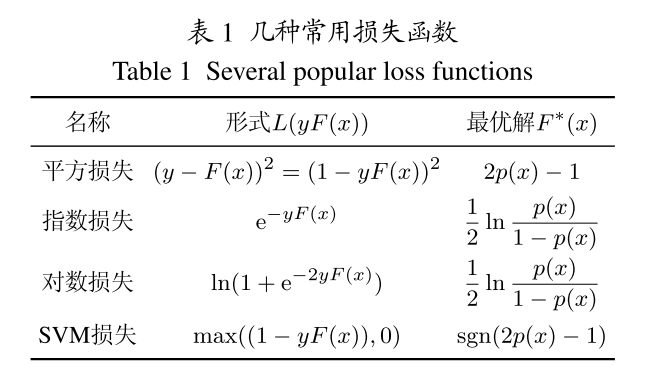
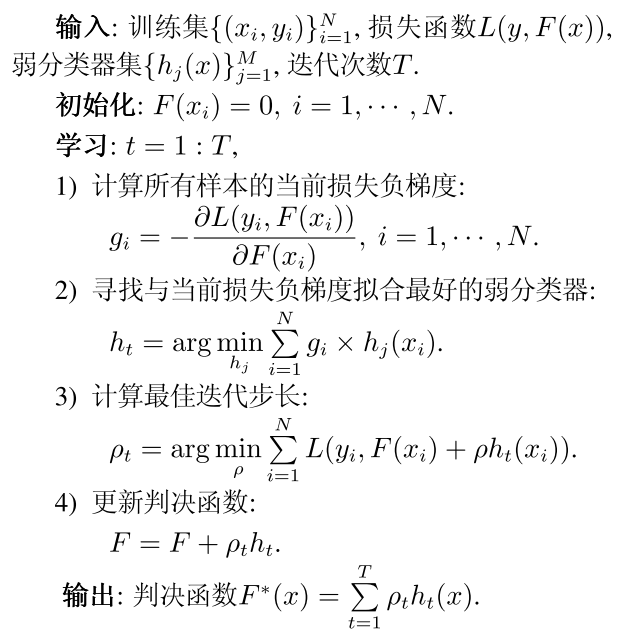

## Cost-sensitive与损失函数

之前设计的所有Cost-sensitive算法, 无论是rescaling还是reweighted类算法, 或是数据预处理, 或是非cost-sensitive分类器内部更新逻辑改造, 或是模型之间相互配合. 但都是对某个或某类特殊的算法模型进行改造, 并没有一个通用的算法.

而任何分类器的训练都需要一个损失函数来推动学习的进行, 如果能够根据cost matrix, 直接对损失函数进行改变, 使之成为**代价敏感损失**, 就有着很大的通用性.

这里探索**代价敏感损失**的**设计准则**.

## 代价敏感损失函数

在分类问题中, 常用损失函数有平方损失, 指数损失, 对数损失, SVM损失等. 针对Cost-sensitive分类问题, 可构造Cost-sensitive损失函数, 通过优化**代价敏感风险**达到最小化分类代价的目的.

正式表述如下:

已知样本空间$$X$$, 类别空间$$Y=\{ \pm 1\}$$. 给定样本$$(x, y), x \in X, y \in Y$$, **代价敏感损失函数**为$$L_{C}(y, F(x))$$, 是度量分类器$$F$$对$$(x, y)$$的**预测损失**. 其中$$C$$是代价矩阵.

Cost-sensitive学习算法优化**整个样本空间**的代价敏感损失, 得到**代价敏感风险**$$E_{X, Y}\left[L_{C}(y, F(x))\right]$$, 这是一个期望值. 再求**代价敏感决策函数**$$F_{C}^{*}$$:

$$F_{C}^{*}=\arg \min _{F} E_{X, Y}\left[L_{C}(y, F(x))\right]$$

这样得到的就是当前样本集合代价矩阵下, 最优的分类器.

在给定具体样本$$x$$情况下, **代价敏感风险**$$E_{X, Y}\left[L_{C}(y, F(x))\right]$$可以转换为优化**条件代价敏感风险**$$E_{Y}\left[L_{C}(y, F(x)) | x\right]$$, 即采用$$F$$对$$x$$的类别进行预测产生的风险, 代价敏感决策函数的求解也变为:

$$F_{C}^{*}(x)=\arg \min _{F} E_{Y}\left[L_{C}(y, F(x)) | x\right]$$

## 代价敏感损失函数设计准则

依据**Bayes最优分类**, 提出代价敏感损失函数的**一般设计准则**.

### Bayes最优分类

以二分类问题为例, 代价矩阵(cost matrix)为:

$$
C=\left[ \begin{array}{ll}{c_{++}} & {c_{+-}} \\ {c_{-+}} & {c_{--}}\end{array}\right]
$$

其中$$c_{ab}$$是将$$b$$类样本预测为$$a$$类样本的代价, 根据Bayes决策理论, 最优决策应最小化期望分类代价, 因此, 将一个样本分为正样本的条件是, 造成的**分类成正样本造成的预期cost比分成负样本造成的cost小**, 否则为负, 即需要满足:

$${c_{++} p(x)+c_{+-}(1-p(x)) \leqslant}  {c_{-+} p(x)+c_{--}(1-p(x))}$$

其中的$$p(x)=\mathrm{P}(y=+1 | x)$$为**后验概率**, 即分类器$$F$$预测的该样本的为正样本的概率.

记$$c_{+}=c_{-+}-c_{++}, c_{-}=c_{+-}-c_{--}$$分别表示正负类样本的分类代价, 可以将**Bayes分类器**记为:

$$
\text{x's label} = \left\{\begin{array}{l}{1, \quad p(x) \geqslant \frac{c_{-}}{c_{+}+c_{-}}} \\ {-1, p(x)<\frac{c_{-}}{c_{+}+c_{-}}}\end{array}\right.
$$

也可以记为$$\operatorname{sgn}\left(p(x)-\frac{c_{-}}{c_{+}+c_{-}}\right)$$.

当正负类别分类代价相等时, 即$$c_{+}=c_{-}$$, Bayes分类器为$$\operatorname{sgn}\left(p(x)-\frac{1}{2}\right)$$.

### 代价敏感损失设计准则

**准则 1**

代价敏感损失$$L_{C}(y, F(x))$$需满足Bayes一致性.

即根据代价敏感损失$$L_{C}(y, F(x))$$求得的最优分类器$$F_{C}^{*}(x)$$始终可以使用$$\operatorname{sgn}\left(F_{C}^{*}(x)\right)$$的形式来进行决策, 即当$$p(x)$$以某个值为界限进行分类. 符合Bayes分类器的形式.

准则1保证优化代价敏感风险得到的分类器$$F_{C}^{*}(x)$$能最小化期望分类代价, 实现最优代价敏感分类.

---

额外补充一句, 从上面可以看出, 这里的$$F(x)$$是一个**判决函数**, 大于零代表一类样本, 小于零代表另一类样本. 注意与模型本身输出的区别, 一般分类模型的输出是属于每个类别的概率$$p(x)$$, 而判决函数$$F(x)$$则是$$p(x)$$的函数, 例如最简单的$$F(x)=2p(x)-1$$, 即二分类模型以0.5为界限.

**准则 2**

$$F_{C}^{*}(x)$$对应的**条件代价敏感风险**$$E_{Y}\left[L_{C}(y, F(x)) | x\right]$$在Bayes分类边界$$\left\{x | p(x)=\frac{c_{-}}{c_{+}+c_{-}}\right\}$$处取得最大值.

Bayes分类器的期望分类代价为:

$$
\text{cost}=\left\{\begin{array}{ll}{c_{-}(1-p(x)),} & {p(x) \geqslant \frac{c_{-}}{c_{+}+c_{-}}} \\ {c_{+} p(x),} & {p(x)<\frac{c_{-}+c_{-}}{c_{+}+c_{-}}}\end{array}\right.
$$

在分类边界$$\left\{x | p(x)=\frac{c_{-}}{c_{+}+c_{-}}\right\}$$处, 将样本$$x$$判为正负类别的分类代价相等并达到最大值$$\frac{c_{+}c_{-}}{c_{+}+c_{-}}$$, 此时最难预测样本类别. 因此根据Bayes最优分类, 给定$$x$$, $$F_{C}^{*}(x)$$对其预测产生的风险$$E_{Y}\left[L_{C}(y, F(x)) | x\right]$$应同样在Bayes分类边界处取得最大值.

准则2保证代价敏感损失能更有效地近似分类代价, 在最优决策处的代价敏感损失和分类代价有一样的全局性质.

---

这两条准则都是把通过 **(条件)代价敏感风险** 得到的$$F_{C}^{*}(x)$$与使用 **最优决策应最小化期望分类代价** 贝叶斯分类的形式联系起来.

### 代价敏感损失函数

以几种常用的分类损失函数为例, 分析**两类**代价敏感损失函数的性能.

具体涉及到平方损失, 指数损失, 对数损失, SVM损失四种.

- 平方损失在神经网络, 回归中得到广泛应用
- 指数损失成功应用于boosting算法, 如Adaboost算法
- 对数损失应用于Logistic回归分析

关于这些损失函数的样子, 以及在上述算法模型中是如何使用对应函数的, 参考[机器学习-损失函数](http://www.csuldw.com/2016/03/26/2016-03-26-loss-function/).

这几种损失函数均可表示为**间隔**$$y F(x)$$的函数, 即$$L(y, F(x))=L(y F(x))$$, 如下图表示:

注意其中的一些转换, 如平方损失如何转到分类问题上, 对数损失与逻辑回归的关系等.

关于各个损失函数的**条件风险**$$E_{X, Y}\left[L_{C}(y, F(x))\right]$$和**最优决策函数**$$F_{C}^{*}(x)$$, 与模型输出概率$$p(x)$$的关系见参考资料中的第一篇论文: [代价敏感学习中的损失函数设计](http://jcta.alljournals.ac.cn/cta_cn/ch/reader/create_pdf.aspx?file_no=CCTA140519&flag=1&journal_id=cta_cn&year_id=2015). 有图例说明, 直观清晰.

**引入分类代价的策略**

通常有两种:

- 分类代价在损失函数外: $$c_{y} L(y F(x))$$
- 分类代价在损失函数内: $$L(y c_{y} F(x))$$

两种方法的理论和对比在论文中也有详细说明, 这里就不展开了. 总结如下:

- 分类代价在损失函数外的方法, 各种形式的损失函数均满足**准则1**, 但除了SVM损失外, 都不满足**准则2**
- 分类代价在损失函数内的方法, 各种形式的损失函数均既满足**准则1**, 又满足**准则2**
- 引入分类代价后, 最直观的改变是**分类边界**的改变. 从之前的0.5, 变化到一个小于0.5的值

## 如何使用代价敏感损失设计准则

注意这里的损失函数, 与算法模型中直接拿来训练, 计算梯度的损失函数不是一个概念.

论文中给出一种boosting方法, 即采用**泛函空间的梯度下降法**拟合**判决函数F**. 构造弱分类器集合, 每次迭代从中选择出与前条件风险负梯度拟合最好的弱分类器, 计算其最优步长, 最终判决函数是所有弱分类器的加权组合:

关键在于第二步, 根据当前判决函数所在的泛函空间中的负梯度, 去拟合一个分类器. 具体的拟合方法没有提及, 但猜测由于判决函数$$F(x)$$是$$p(x)$$的函数, 可以由$$F(x)$$计算出$$p(x)$$.

---

另外, 上述四种损失函数对应的最优判决函数$$F_{C}^{*}(x)$$与$$p(x)$$之间是可导的, 是不是可以使用链式法则, 直接求出损失对于模型中参数的负梯度, 直接更新模型内部的参数?

## 参考资料

- [代价敏感学习中的损失函数设计](http://jcta.alljournals.ac.cn/cta_cn/ch/reader/create_pdf.aspx?file_no=CCTA140519&flag=1&journal_id=cta_cn&year_id=2015)
