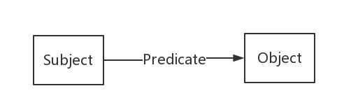

# 知识表示

知识表示是将知识信息**存储**, **组织**, **表达**的方法, 使已有的知识关系明确, 易于推理.

## 语义网络

知识图谱的表示形式是基于**语义网络**(Semantic Network)的. 简单来说, 语义网络是由**节点**和**边**组成的**有向图**, 也称为**语义网**(Semantic Web):

- 节点: 也称为**语义类型**. 表示各种概念, 实体, 事务, 状态等
- 边: 也称为**语义关系**. 指明所连接的两个结点之间的某种关系

下图是语义网络的一个例子:


语义网虽然清晰明确, 但只能支持简单的网络, 主要的缺点集中在以下几个方面:

- 没有标准, 节点和边的值完全是用户自由定义的
- 无法区分**概念节点**和**实体节点**. 这点在下面说明
- 没有**标签**(label)系统, 无法对节点和边定义schema

## RDF

RDF(Resource Description Framework), **资源描述框架**, 本质是一个**数据模型**(Data Model), 即表示事物的一种方法, 提供了一个统一的标准, 用于描述实体/资源.

RDF形式也是由节点和边组成, 使用**三元组**来表示关系, 即(节点, 边, 节点), 也称为一条语句, 或一条知识. 具体来是, 这个三元组是**SPO三元组**, 即Subject(主体), Predicate(谓语), Object(客体), 如下图所示.



节点表示实体/属性, 边表示**实体与实体**, **实体与属性**之间的关系. 关于RDF的例子和详细内容参考[为什么需要知识图谱？什么是知识图谱？——KG的前世今生](https://zhuanlan.zhihu.com/p/31726910).

### RDF模型定义方法

实体是组成知识图谱的关键之一, 每个实体在图中都是唯一的, 因此我们需要一种方法, 来对实体节点进行唯一的表示. 以下图中与罗纳尔多相关的知识为例, 对于罗纳尔多这个实体, 使用`www.kg.com/person/1`来表示. 采用URL/URI的形式.

此外对于连接实体或连接实体与属性之间的关系, 经过抽象后, 也可以使用这种形式来表示. 例如, 罗纳尔多这个实体(`www.kg.com/person/1`)的中文名称为`罗纳尔多`, 将中文名称这个关系进行抽象, 我们可以将这个关系表示为`http:// www.kg.com/ontology/chineseName`. 对于其他的实体, 如果有中文名称, 则它们之间的连接关系都可以用这个唯一关系来表示.

上面所述的这种形式, 无论是节点还是边, 我们都称为一个**IRI**(International Resource Identifiers), 每个IRI唯一定义了一个实体或关系.

而对于属性值, 更多的会使用纯文本来描述. 因此, RDF图中的所有节点和边, 一般来说, 一共有两种类型: **IRI**和**Literal**(纯文本). 三元组中, 每部分的类型约束为:

- Subject: **IRI**
- Predicate: **IRI**
- Object: **IRI**或**Literal**

### 存储/序列化形式

RDF数据集的存储方式, 或者说序列化方法有很多种, 常用的有XML, N-Triples, Turtle等. **Turtle**可以说是RDF序列化最常用的一种方式了. 使用Turtle格式, 下图代表的知识图谱可以用下面的内容表示.


```
@prefix person: <http://www.kg.com/person/> .
@prefix place: <http://www.kg.com/place/> .
@prefix : <http://www.kg.com/ontology/> .

person:1 :chineseName "罗纳尔多·路易斯·纳萨里奥·德·利马"^^string.
person:1 :career "足球运动员"^^string.
person:1 :fullName "Ronaldo Luís Nazário de Lima"^^string.
person:1 :birthDate "1976-09-18"^^date.
person:1 :height "180"^^int. 
person:1 :weight "98"^^int.
person:1 :nationality "巴西"^^string. 
person:1 :hasBirthPlace place:10086.
place:10086 :address "里约热内卢"^^string.
place:10086 :coordinate "-22.908333, -43.196389"^^string.
```

也可以对同一个实体统一表示, 形式更紧凑:

```
@prefix person: <http://www.kg.com/person/> .
@prefix place: <http://www.kg.com/place/> .
@prefix : <http://www.kg.com/ontology/> .

person:1 :chineseName "罗纳尔多·路易斯·纳萨里奥·德·利马"^^string;
         :career "足球运动员"^^string;
         :fullName "Ronaldo Luís Nazário de Lima"^^string;
         :birthDate "1976-09-18"^^date;
         :height "180"^^int;
         :weight "98"^^int;
         :nationality "巴西"^^string; 
         :hasBirthPlace place:10086.
place:10086 :address "里约热内卢"^^string;
            :coordinate "-22.908333, -43.196389"^^string.
```

### RDF的表达能力

这样, RDF模型克服了语义网络没有标准的缺点. 但仍然无法区分类和实体(对象), 因此缺乏**抽象能力**, 无法对同一个类别的事物进行定义和描述.

## RDFS

RDFS(RDF Schema)在RDF的基础上提供了概念的定义方式, 以及哪些属性可以应用到哪些对象上. 换句话说, RDFS为RDF模型提供了一个基本的类型系统.

类比于结构性数据库, 可以把数据库中的每一张表认为是一个类(Class), 表中的每一行数据都是该类的一个对象/实例, 而表中的列名代表着这个类所有的关系, 其中的每个数据表示一个实例的一个属性值. 这样就有了抽象能力.

RDFS的本质上是一些**预定义词汇**构成的集合, 对RDF进行类的定义和属性的定义. 在表现形式上, 就是RDF, 其序列化方法仍然与RDF通用.

这里所说的预定义词汇, 是RDFS模型预先定义好的一些词汇, 如:

- rdf:type. 隶属于关系
- rdf:Property. 表示正在定义一个属性
- rdfs:Class. 用于定义类
- rdfs:domain. 用于表示该属性属于哪个类别
- rdfs:range. 用于描述该属性的取值类型
- rdfs:subClassOf. 用于描述该类的父类, 比如, 可以定义一个运动员类, 声明该类是人的子类
- rdfs:subProperty. 用于描述该属性的父属性, 比如, 可以定义一个名称属性, 声明中文名称和全名是名称的子类

一个完整的例子如下:

```
@prefix rdfs: <http://www.w3.org/2000/01/rdf-schema#> .
@prefix rdf: <http://www.w3.org/1999/02/22-rdf-syntax-ns#> .
@prefix : <http://www.kg.com/ontology/> .

### 这里我们用词汇rdfs:Class定义了“人”和“地点”这两个类。
:Person rdf:type rdfs:Class.
:Place rdf:type rdfs:Class.

### rdfs当中不区分数据属性和对象属性，词汇rdf:Property定义了属性，即RDF的“边”。
:chineseName rdf:type rdf:Property;
        rdfs:domain :Person;
        rdfs:range xsd:string .

:career rdf:type rdf:Property;
        rdfs:domain :Person;
        rdfs:range xsd:string .
        
:fullName rdf:type rdf:Property;
        rdfs:domain :Person;
        rdfs:range xsd:string .
        
:birthDate rdf:type rdf:Property;
        rdfs:domain :Person;
        rdfs:range xsd:date .

:height rdf:type rdf:Property;
        rdfs:domain :Person;
        rdfs:range xsd:int .
        
:weight rdf:type rdf:Property;
        rdfs:domain :Person;
        rdfs:range xsd:int .
        
:nationality rdf:type rdf:Property;
        rdfs:domain :Person;
        rdfs:range xsd:string .
        
:hasBirthPlace rdf:type rdf:Property;
        rdfs:domain :Person;
        rdfs:range :Place .
        
:address rdf:type rdf:Property;
        rdfs:domain :Place;
        rdfs:range xsd:string .
        
:coordinate rdf:type rdf:Property;
        rdfs:domain :Place;
        rdfs:range xsd:string .
```

在定义类之后, 知识图谱就可以分为两个层面了: **模式层**和**数据层**. 如下图:


其中`Vocabulary`是定义的类和属性, 即模式层. 而`Data`则是数据层, 代表着具体的实例.

## OWL

OWL(Ontology Web Language)是RDFS的一个扩展, 其添加了额外的预定义词汇, 主要提供高效的自动推理能力.

- owl:Class: 定义类
- owl:DatatypeProperty: 定义了数据属性, 即这个属性关系连接的是一个数据, 如字符串
- owl:ObjectProperty: 定义了对象属性, 这个属性连接的是另一个类/实体
- owl:TransitiveProperty: 表示该属性具有传递性质
  - 例如, 我们定义`位于`是具有传递性的属性, 若A位于B, B位于C, 那么A肯定位于C
- owl:SymmetricProperty: 表示该属性具有对称性
  - 例如, 我们定义`认识`是具有对称性的属性, 若A认识B, 那么B肯定认识A
- owl:FunctionalProperty: 表示该属性取值的唯一性
  - 例如, 我们定义`母亲`是具有唯一性的属性, 若A的母亲是B, 在其他地方我们得知A的母亲是C, 那么B和C指的是同一个人
- owl:inverseOf: 定义某个属性的相反关系
  - 例如, 定义`父母`的相反关系是`子女`, 若A是B的父母, 那么B肯定是A的子女

而使用一下的几个词汇, 是的知识图谱具有了融合能力

- owl:equivalentClass: 表示某个类和另一个类是相同的
- owl:equivalentProperty: 表示某个属性和另一个属性是相同的
- owl:sameAs: 表示两个实体是同一个实体
