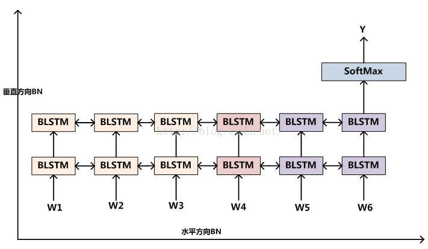
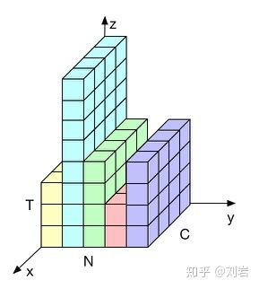

# Batch Normalization

[Batch Normalization: Accelerating Deep Network Training by Reducing Internal Covariate Shift](https://arxiv.org/abs/1502.03167)论文中提出了**Batch Normalization**这种结构. 从名字中可以看出, Batch Normalization是设计用来消除Internal Covariate Shift问题的, 这种问题出现的原因, 表现和影响在[Normalization综述](Normalization综述.md)已经详细说明过了.

对于Mini-Batch SGD优化算法, 一次迭代中包含若干个样本. 不同迭代轮次使用的不同batch之间, 样本之间的分布差别可能会很大, 因此无论输入层还是隐层的分布都是不稳定的, 出现ICS问题.

Batch Normalization的主要思想, 是对于每个**神经元**, 数据在进入**激活函数之前**, 计算出每个神经元在这个batch中的均值和方差, 然后通过偏移, 缩放, 以及再偏移, 再缩放, 使得这个神经元保持相对稳定的输入分布.

## 训练过程

Batch Normalization针对单个神经元进行. 假设一个batch中有$$m$$个样本, 对于FNN网络, 在一个batch中进行如下步骤:

$$\mu=\frac{1}{m} \sum_{i=1}^{m} z^{(i)}$$

$$\sigma^{2}=\frac{1}{m} \sum_{i=1}^{m}\left(z^{(i)}-\mu\right)^{2}$$

$$z_{\text {Norm }}^{(i)}=\frac{z^{(i)}-\mu}{\sqrt{\sigma^{2}+\varepsilon}}$$

$$\tilde{z}^{(i)}=\gamma z_{\text {Nom }}^{(i)}+\beta$$

经过这几部处理后, 得到了最终输入到激活函数中的数据, 具有分布的稳定性.

## 推理过程

在推理阶段, 一般输入只有一个实例, 而不是与输入相同大小的batch size. 这时就不能再使用输入数据计算均值和方差了.

这就需要使用训练阶段的统计数据来作用了. 具体来说, 在推理阶段, 直接使用训练阶段所有的样本实例, 计算**全局统计量**, 来代替一个batch中的统计量. 这样更为准确. 如何获得这个全局统计量呢?

对于训练阶段的每次迭代, 都会得到这次迭代batch中$$m$$个样本的均值和方差, 使用这里的均值和方差的期望, 即计算所有batch均值的平均值得到全局均值, 计算所有batch方差的无偏估计得到全局方差:

$$
\begin{aligned}
\mathrm{E}[x] & \leftarrow \mathrm{E}_{\mathcal{B}}\left[\mu_{\mathcal{B}}\right] \\
\operatorname{Var}[x] & \leftarrow \frac{m}{m-1} \mathrm{E}_{\mathcal{B}}\left[\sigma_{\mathcal{B}}^{2}\right]
\end{aligned}
$$

然后每个神经元都有训练好的再偏移参数$$\beta$$和再缩放参数$$\gamma$$, 所以推理阶段的值由下式得到:

$$y=\frac{\gamma}{\sqrt{\operatorname{var}[x]+\epsilon}} \cdot x+\left(\beta-\frac{\gamma \mathrm{E}[x]}{\sqrt{\operatorname{var}[x]+\epsilon}}\right)$$

上式和$$y^{(k)}=\gamma^{(k)} \widehat{x}^{(k)}+\beta^{(k)}$$式是等价的, 之所以把$$\widehat{x}$$拆开是因为$$\frac{\gamma}{\sqrt{\operatorname{var}[x]+\epsilon}}$$和$$\left(\beta-\frac{\gamma \mathrm{E}[x]}{\sqrt{\operatorname{var}[x]+\epsilon}}\right)$$对于每个神经元都是可以提前计算好, 存储起来的, 在推理时直接使用, 加速了推理的效率.

## BN与CNN

在CNN中使用Batch Normalization, 秉承了CNN的核心思想, **权值共享**, 对于每个通道, 使用同样的参数, 类似于将一个通道作为一个神经元来处理.

假设卷积后, 进入激活函数之前, 此时的**feature map**的大小为$$(N, C, H, W)$$, 其中$$N$$是batch size, $$C$$为通道数量, $$H$$和$$W$$分别为高和宽. 对于每个通道, 我们计算得到一个均值和方差**标量**, 并设置一个可训练的再偏移参数和再缩放参数**标量**, 因此卷积层最后得到的均值, 方差等向量的长度为该层通道的数量.

单个通道的均值和方差计算公式如下, 都是标量:

$$\mu_{c}(x)=\frac{1}{N H W} \sum_{n=1}^{N} \sum_{h=1}^{H} \sum_{w=1}^{W} x_{n c h w}$$

$$\sigma_{c}(x)=\sqrt{\frac{1}{N H W} \sum_{n=1}^{N} \sum_{h=1}^{H} \sum_{w=1}^{W}\left(x_{n c h w}-\mu_{c}(x)\right)^{2}+\varepsilon}$$

可以看到, 是在$$N \times H \times W$$上进行的计算.

## BN的使用位置

**全连接层或卷积操作之后, 激活函数之前.**

## BN与RNN

RNN使用BN结构, 有**水平方向**和**垂直方向**两个方向. 水平方向就是在时间维度上展开, 垂直方向是多层RNN的叠加形成Stacked RNN. 直观上在水平/时间方向上引入BN是更自然的一种选择, 但多篇论文对两个方向上使用BN进行了探讨和实验, 在[Batch normalization是否适用于循环神经网络？](https://www.zhihu.com/question/350853003)文章中有简单的探讨.

用公式来表示两个方向使用BN, RNN中$$t$$时间的隐层输出为:

$$\mathbf{h}_{t}=\phi\left(\mathbf{W}_{h} \mathbf{h}_{t-1}+\mathbf{W}_{x} \mathbf{x}_{t}\right)$$

使用BN之后:

$$\mathbf{h}_{t}=\phi\left( \mathrm{BN}\left(\mathrm{W}_{h} \mathrm{h}_{t-1} ; \gamma_{h}, \beta_{h}\right)+\mathrm{BN}\left(\mathrm{W}_{x} \mathrm{x}_{t} ; \gamma_{x}, \beta_{x}\right) \right)$$

前后分别对应着水平方向的BN和垂直方向上的BN.

但无论是水平方向还是垂直方向, 使用BN都需要考虑使用方法, 即均值, 方差是如何被计算出来的.

为详细说明, 以上图为例, 输入是$$N \times C \times T$$的维度, $$N$$为batch size, $$C$$为隐层的神经元数量, $$T$$为时间长度. 上图中的这个batch中共有5个样本, 且这5个样本的长度参差不齐, 隐层的长度也为5. 对于Batch Normalization, 计算均值和方差时自然要在整个batch上进行, 所以计算均值和方差有以下几个方案.

- $$N$$: 这种方案代表着对每个时间片中每个隐层神经元都计算并统计均值, 方差, 并设置再偏移和再缩放的可训练参数. 这种方案带来的参数是最多的
- $$N \times C$$: 即对每个时间片计算一个均值, 方差. 一个时间片上的所有神经元共享统计值
- $$N \times T$$: 神经元角度, 计算单个神经元在所有时间片上的均值和方差

后面两种是如同在CNN中使用BN一样, 从参数共享的角度考虑.

因为RNN网络是按时间维度进行推进的, 相对于可以展开成一个**隐藏层共享参数的MLP**, 而且最终层数由输入数据的时间片的数量决定, RNN是一个动态的网络. 一个自然的想法就是每个时间片进行独立的统计, 即对应$$N$$和$$N \times C$$两种情况. 但这种情况存在一个问题:

每个样本的有效长度是不同的, 当统计到比较靠后的时间片时, 此时batch中的样本就很少了. 例如上图当$$t\gt4$$时, 这个batch size为5的batch就只有一个样本了, 也就无从统计均值和方差, BN也无法推进. 所以每个时间片分别统计这种策略存在一定的问题.

再看$$N \times T$$这种策略, 即对于每个神经元进行统计. 这个角度与FNN中的类似, 也是考虑到RNN中不同时间片的权值共享的情况. 但权值共享不等于输入相似, 实际中, 不同时间片的输入分布有差别才是正常的现象, 而将这种差别强行堆叠在一个量中, 显然是不太合适的. 就如同FNN, CNN中, 所有layer共享BN参数.

另外还有一个原因, RNN时间片之间是串行的, 对于同一个神经元, 在前后不同时间片进行统计时使用到的数据量也是不同的, 靠后明显有更多的数据, 这样也就产生了偏差.

因此在RNN中如何使用BN就成了一个问题, 实际上不同论文对RNN+BN不同方法的效果验证之间也是有矛盾的.

实践上, 如果RNN需要使用Normalization, 更多的是使用**Layer Normalizaiton**.

这一部分可以参考:

- [Batch Normalization的概述和应用包括在CNN和RNN中的应用](https://blog.csdn.net/yimingsilence/article/details/80261383)
- [模型优化之Layer Normalization](https://zhuanlan.zhihu.com/p/54530247)

## BN的优缺点

### 优点

- 保持隐藏层中数值的均值, 方差不变, 让数值更稳定, 为后面网络提供坚实的基础, 加快了收敛速度
- 允许较大的学习率
- 有轻微的正则化作用, 相当于给隐藏层加入噪声
- 减弱对初始化的强依赖性

### 缺点

- 每次是在一个batch上计算均值, 方差, 如果batch size太小, 则计算的均值, 方差不足以代表整个数据分布
- batch size太大, 计算时会超过内存容量

# 参考资料

- [Batch Normalization导读](https://zhuanlan.zhihu.com/p/38176412)
- [常用的 Normalization 方法：BN、LN、IN、GN](https://blog.csdn.net/ai_study/article/details/101523486)
