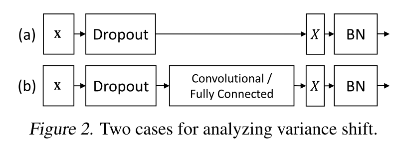

在Batch Normalization提出之后的很多流行网络结构里, 之前常用的Dropout结构被抛弃. 如果将两种结构在同一个网络中使用, 得到的结果基本是性能的下降. [Understanding the Disharmony between Dropout and Batch Normalization by Variance Shift](https://arxiv.org/abs/1801.05134)这篇论文从**variance shift**解释了这个问题的原因.

作者就按两种情况进行分析:

第二种是常见的Dropout和Batch Normalization结构使用方法, Dropout结构放在每一层的输出之后, BN结构放在激活函数之前. 上一层的输出在Dropout之后, 经过卷积层或全连接层之后, 经过BN结构调整分布后, 作为输入进入激活函数, 产生这一层的输出. 第一种结构是Dropout之后紧跟BN, 是为了更直观的说明这种现象.

### 原因

出现Dropout和Batch Normalization不能共存的原因是因为在训练阶段和预测阶段出现了**variance shift**.

Dropout由于随机地对神经元输出进行mask, 所以相对于输入, Dropout改变了输出的分布, 包括均值和方差. 其中均值可以通过缩放进行调整, 一般在根据其`keep ratio` $$p$$, 在训练阶段对输出进行$$\frac{1}{p}$$的放大, 或在预测阶段进行$$p$$的缩小. 但方差