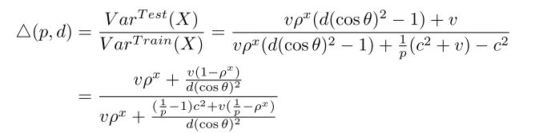

在Batch Normalization提出之后的很多流行网络结构里, 之前常用的Dropout结构被抛弃. 如果将两种结构在同一个网络中使用, 得到的结果基本是性能的下降. [Understanding the Disharmony between Dropout and Batch Normalization by Variance Shift](https://arxiv.org/abs/1801.05134)这篇论文从**variance shift**解释了这个问题的原因.

作者就按两种情况进行分析:

第二种是常见的Dropout和Batch Normalization结构使用方法, Dropout结构放在每一层的输出之后, BN结构放在激活函数之前. 上一层的输出在Dropout之后, 经过卷积层或全连接层之后, 经过BN结构调整分布后, 作为输入进入激活函数, 产生这一层的输出. 第一种结构是Dropout之后紧跟BN, 是为了更直观的说明这种现象.

### 原因

出现Dropout和Batch Normalization不能共存的原因是因为在训练阶段和预测阶段出现了**variance shift**.

Dropout由于随机地对神经元输出进行mask, 所以相对于输入, Dropout改变了输出的分布, 包括均值和方差. 其中均值可以通过缩放进行调整, 一般在根据其`keep ratio` $$p$$, 在训练阶段对输出进行$$\frac{1}{p}$$的放大, 或在预测阶段进行$$p$$的缩小. 但在方差上带来的变化, 是难以明确表示的. 但是分析**BN的输入的方差**能够解释这种现象产生的原因.

作者通过两种Dropout和BN的连接方式, 来说明在BN之前增加一层Dropout, 会对网络产生影响. 两种连接方式如上图.

**以第一种连接方式切入**, 假设上一层的输出维度为$$d$$, 在训练时, 上一层的第$$k$$个神经元在经过Dropout之后的值为:

$$X=a_{k} \frac{1}{p} x_{k}, k=1 \ldots d$$

其中$$a_{k} \sim P$$, 而$$P\left(a_{k}\right)=\left\{\begin{array}{cc}
1-p, & a_{k}=0 \\
p, & a_{k}=1
\end{array}\right.$$是Dropout的mask结果, 而乘以$$\frac{1}{p}$$是常用的为了保持在训练和预测不同阶段经过Dropout后的输出均值一致的手段.

在预测时, 输出为简单的$$X=x_{k}$$.

训练时, 上一层的输出, 在进入到Batch Normalization之前, 只经过了Dropout, 对应BN的输入的方差为:

$$
\begin{array}{l}
\operatorname{Var}^{T r a i n}(X)=\operatorname{Var}\left(a_{k} \frac{1}{p} x_{k}\right)=E\left(\left(a_{k} \frac{1}{p} x_{k}\right)^{2}\right)-E^{2}\left(a_{k} \frac{1}{p} x_{k}\right) \\
=\frac{1}{p^{2}} E\left(a_{k}^{2}\right) E\left(x_{k}^{2}\right)-\frac{1}{p^{2}}\left(E\left(a_{k}\right) E\left(x_{k}\right)\right)^{2}=\frac{1}{p}\left(c^{2}+v\right)-c^{2}
\end{array}
$$

而预测阶段对应的方差为:

$$
\operatorname{Var}^{T e s t}(X)=\operatorname{Var}\left(x_{k}\right)=v
$$

所以, 训练阶段BN学习到的输入的方差应当接近$$\left.E_{\mathcal{B}}^{\prime}\left(\frac{1}{p}\left(c^{2}+v\right)-c^{2}\right)\right)$$, 但预测阶段BN的输入与之不匹配, 因此预测阶段输入到BN中的信息产生了**variance shift**, 可以用一下公式衡量:

$$\triangle(p)=\frac{\operatorname{Var}^{T e s t}(X)}{\operatorname{Var}^{T r a i n}(X)}=\frac{v}{\frac{1}{p}\left(c^{2}+v\right)-c^{2}}\le{1}$$

因此, 在预测阶段, 每一层都会出现这样的variance shift, 影响下一层的表现, 随着前向传播的加深, variance shift的现象被放大. 最后的输出因此发生变化, 导致网络的性能下降.

**对于第二种连接方式**, 作为现在网络中常见的结构, Dropout和BN之间连接着卷基层或全连接层. 假设上一层的输出是一个$$d$$维的向量$$\mathbf{x}=\left(x_{1} \ldots x_{d}\right)$$, 某个神经元的参数为$$\mathbf{w}=\left(w_{1} \ldots w_{d}\right)$$, 那么在训练时, 这个神经元的输出为$$X=\sum_{i=1}^{d} w_{i} a_{i} \frac{1}{p} x_{i}$$, 预测时的输出为$$X=\sum_{i=1}^{d} w_{i} x_{i}$$.

则训练阶段BN输入的方差为:

$$
\begin{array}{l}
\operatorname{Var}^{T r a i n}(X)=\operatorname{Cov}\left(\sum_{i=1}^{d} w_{i} a_{i} \frac{1}{p} x_{i}, \sum_{i=1}^{d} w_{i} a_{i} \frac{1}{p} x_{i}\right) \\
=\frac{1}{p^{2}} \sum_{i=1}^{d}\left(w_{i}\right)^{2} \operatorname{Var}\left(a_{i} x_{i}\right) + \frac{1}{p^{2}} \sum_{i=1}^{d} \sum_{j \neq i}^{d} \rho_{i, j}^{a x} w_{i} w_{j} \sqrt{\operatorname{Var}\left(a_{i} x_{i}\right)} \sqrt{\operatorname{Var}\left(a_{j} x_{j}\right)} \\
=\left(\frac{1}{p}\left(c^{2}+v\right)-c^{2}\right)\left(\sum_{i=1}^{d} w_{i}^{2}+\rho^{a x} \sum_{i=1}^{d} \sum_{j \neq i}^{d} w_{i} w_{j}\right)
\end{array}
$$

预测阶段BN输入的方差为:

$$
\begin{array}{c}
\operatorname{Var}^{T e s t}(X)=\operatorname{Var}\left(\sum_{i=1}^{d} w_{i} x_{i}\right)=\operatorname{Cov}\left(\sum_{i=1}^{d} w_{i} x_{i}, \sum_{i=1}^{d} w_{i} x_{i}\right) \\
=\sum_{i=1}^{d} w_{i}^{2} v+\sum_{i=1}^{d} \sum_{j \neq i}^{d} \rho_{i, j}^{x} w_{i} w_{j} \sqrt{v} \sqrt{v} \\
=v\left(\sum_{i=1}^{d} w_{i}^{2}+\rho^{x} \sum_{i=1}^{d} \sum_{j \neq i}^{d} w_{i} w_{j}\right)
\end{array}
$$

经过一系列复杂的推导, variance shift可以表示为:

$$
\begin{array}{l}
\frac{\operatorname{Var}^{T e s t}(X)}{\operatorname{Var}^{T r a i n}(X)} = \frac{v\left(\sum_{i=1}^{d} w_{i}^{2}+\rho^{x} \sum_{i=1}^{d} \sum_{j \neq i}^{d} w_{i} w_{j}\right)}{\left(\frac{1}{p}\left(c^{2}+v\right)-c^{2}\right)\left(\sum_{i=1}^{d} w_{i}^{2}+\rho^{a x} \sum_{i=1}^{d} \sum_{j \neq i}^{d} w_{i} w_{j}\right)} \\
=\frac{v \sum_{i=1}^{d} w_{i}^{2}+v \rho^{x} \sum_{i=1}^{d} \sum_{j \neq i}^{d} w_{i} w_{j}}{\left(\frac{1}{p}\left(c^{2}+v\right)-c^{2}\right) \sum_{i=1}^{d} w_{i}^{2}+v \rho^{x} \sum_{i=1}^{d} \sum_{j \neq i}^{d} w_{i} w_{j}} \\
=\frac{v+v \rho^{x}\left(\left(\sum_{i=1}^{d} w_{i}\right)^{2}-\sum_{i=1}^{d} w_{i}^{2}\right) / \sum_{i=1}^{d} w_{i}^{2}}{\frac{1}{p}\left(c^{2}+v\right)-c^{2}+v \rho^{x}\left(\left(\sum_{i=1}^{d} w_{i}\right)^{2}-\sum_{i=1}^{d} w_{i}^{2}\right) / \sum_{i=1}^{d} w_{i}^{2}} \\
=\frac{v+v \rho^{x}\left(d(\cos \theta)^{2}-1\right)}{\frac{1}{p}\left(c^{2}+v\right)-c^{2}+v \rho^{x}\left(d(\cos \theta)^{2}-1\right)}
\end{array}
$$

其中$$\theta$$是参数向量$$\mathbf{w}$$与$$d$$维$$\mathbf{1}$$向量的夹角. 作者通过实验说明$$d(\cos \theta)^{2}$$这一项大概是与$$d$$是线性关系(事实上在高维空间中, 任意两条超直线大概率成垂直关系. 可以参考[n维空间下两个随机向量的夹角分布](https://kexue.fm/archives/7076)). variance shift最终可以记为:

而如果要使variance shift不出现, 要求$$\triangle(p, d) \rightarrow 1$$. 有两种方法可以做到:

- $$p \rightarrow 1$$, 即不使用Dropout
- $$d \rightarrow \infty$$, 即**网络的宽度尽可能宽**

而在`Wide ResNet`网络中, 网络的每一层更宽, 使用Dropout与BN是可以提升整体效果的, 也印证了这一观点.

### 解决方案

如果一定要同时使用Dropout和Batch Normalization结构, 可以尝试:

- 仅在输出层之前使用, 即将Dropout放到所有的BN层之后, 因此也就不会出现训练阶段和预测阶段variance shift的问题. 一般的输出层是softmax(分类), 且没有BN结构

- 对Dropout进行改造, 使用**variance-stable**的新Dropout. 例如Gaussian Dropout, 以及Uout(一种均匀分布Dropout).

**Uout**的形式为$$X=x_{i}+x_{i} r_{i}, r_{i} \sim \mathcal{U}(-\beta, \beta), 0 \leq \beta \leq 1$$. $$\beta$$是超参数. 使用Uout对应的variance shift为:

$$
\begin{array}{l}
\frac{\operatorname{Var}^{T e s t}(X)}{\operatorname{Var}^{T r a i n}(X)}=\frac{\operatorname{Var}\left(x_{i}\right)}{\operatorname{Var}\left(x_{i}+x_{i} r_{i}\right)}=\frac{v}{E\left(\left(x_{i}+x_{i} r_{i}\right)^{2}\right)} \\
=\frac{v}{E\left(x_{i}^{2}\right)+2 E\left(x_{i}^{2}\right) E\left(r_{i}\right)+E\left(x_{i}^{2}\right) E\left(r_{i}^{2}\right)}=\frac{3}{3+\beta^{2}}
\end{array}
$$

取$$\beta$$的值为0.01, 对应的variance shift为300/301=0.9966777.
