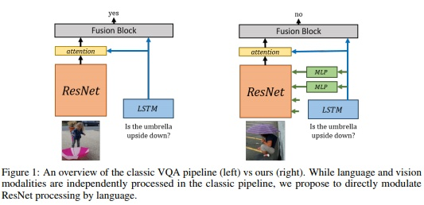
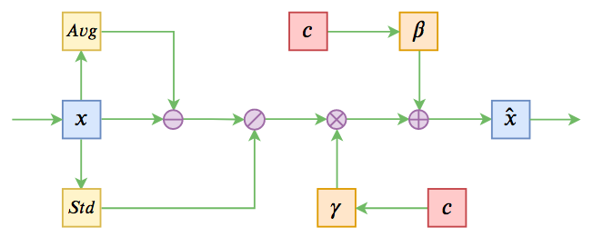

# Conditional Normalization

## 什么是Conditional Normalization

Conditional Normalization(条件归一化), 由[Modulating early visual processing by language](https://papers.nips.cc/paper/7237-modulating-early-visual-processing-by-language.pdf)论文提出. 论文提出的是Conditional Batch Normalization(CBN), 也就是给BN的输出引入条件控制.

传统的BN为:

$$y=\frac{x-\mathbb{E}[x]}{\sqrt{\operatorname{Var}[x]+\epsilon}} \cdot \gamma+\beta$$

其中的$$\gamma$$和$$\beta$$都是网络层的可训练参数, 需要通过反向传播学习. CBN为这两个参数又分别的引入了缩放因子和偏置的调整$$\Delta \beta$$, $$\Delta \gamma$$. $$\Delta \beta$$, $$\Delta \gamma$$分别通过一个MLP小网络得到的, 其输入是样本的feature, 这里的feature往往与原本的输入不同, 一般是希望融合一些额外的信息进来, 例如样本的类别, 多模态任务中的文字等等.

$$\boldsymbol{\Delta} \boldsymbol{\beta}=M L P\left(\boldsymbol{e}_{\boldsymbol{q}}\right) \quad \boldsymbol{\Delta} \boldsymbol{\gamma}=M L P\left(\boldsymbol{e}_{\boldsymbol{q}}\right)$$

$$\hat{\beta}_{c}=\beta_{c}+\Delta \beta_{c} \quad \hat{\gamma}_{c}=\gamma_{c}+\Delta \gamma_{c}$$

因为这里的调整是依赖于样本的补充feature的, 因此可以成为conditional, 最终得到CBN调整后的缩放和偏置因子$$\hat{\gamma}_{c}$$和$$\hat{\beta}_{c}$$.

要注意:

- $$\Delta \beta$$, $$\Delta \gamma$$各自使用不同的MLP, 每一个的缩放和偏置delta各自维护一套MLP参数
- 这里得到的调整$$\boldsymbol{\Delta}\boldsymbol{\gamma}$$, $$\boldsymbol{\Delta}\boldsymbol{\beta}$$是向量, 在FNN中长度为层中神经元的数量, CNN中为该层通道的数量. 即MLP的输出是一个向量

## 为什么需要Conditional Normalization

原论文是为了改进一个基于图片的问答系统, 输入为一张图片和一个针对图片的问题, 输出为问题的答案.

系统一般设计为分别使用不同的网络度对图片和文字提取特征, 然后在顶层使用attention将两者结合, 输出答案, 如上左图. 但作者认为语言会帮助图片进行识别, 因此有必要在对图片进行表征时引入文字说明, 在提取器的底层就开始将两者融合起来, 如上右图.

因此, 在保持图片表征网络结构不变的同时, 对BN相关的参数施加调整. 这种调整方式可以理解为, 根据不同的feature, 强调不同的神经元/通道. 具体的做法就是对LSTM输出的句子向量, 输入到MLP中, 得到调整后缩放和偏置的新权重.

代码见[cbn.py](https://github.com/ap229997/Conditional-Batch-Norm/blob/master/model/cbn.py).

另外, 实际中还常常遇到一个问题, 就是样本是属于不同类别的, 这个类别已知, 但是不同类别可能表现差异很大, 如果将不同类别的样本放在同一个batch中, 使用同样的方法进行BN, 使用同样的均值, 方差, 缩放, 偏置, 也不太妥当. 这时有两种做法:

一种是使用Layer Normalization. 但LN的标签往往不如BN.

另一种就是使用CBN的方法了. 使用标签作为feature, 引导BN对不同的类别进行不同的缩放, 偏置的操作, 从而达到了不同类别不同处理的目的.

这部分相关的代码参考[conditional_batchnorm.py](https://github.com/crcrpar/pytorch.sngan_projection/blob/master/links/conditional_batchnorm.py)

## Conditional Layer Normalization

Layer Normalization也可以引入Conditional的操作. 在[基于Conditional Layer Normalization的条件文本生成](https://kexue.fm/archives/7124)中. 对LN中的缩放$$\gamma$$和偏置因子$$\beta$$使用同样的方法进行调整. 调整逻辑如下图:

代码参考[layers.py](https://github.com/bojone/bert4keras/blob/master/bert4keras/layers.py)中`LayerNormalization`类的实现.

## 使用Conditional Normalization的注意项

现在在NLP中更多的使用BERT相关的预训练模型, 模型中有LN的结构. 为了防止扰乱原来的预训练权重, 在引入CLN后, MLP如果是单层的, 应当以**全零**对参数进行初始化, 这样在初始状态, 模型依然保持跟原来的预训练模型一致.

如果是多层的MLP, 则使用零均值, 较小标准差进行初始化即可.

# 参考资料

- [Conditional Batch Normalization 详解](https://zhuanlan.zhihu.com/p/61248211)
- [基于Conditional Layer Normalization的条件文本生成](https://kexue.fm/archives/7124)
