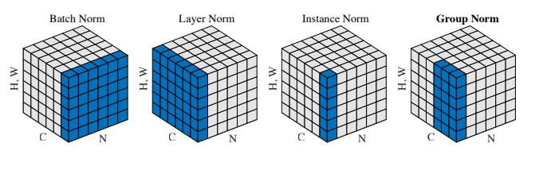

# Layer Normalization

Batch Normalization一个很关键的问题是, 均值方差等都是在一个batch中进行的, 如果一个batch中样本的数据量较少, 得到的统计值可能不能反映全局的统计情况. 因此Batch Normalization需要较大的batch size才能较好的work. 但是如果在有限的资源中运行越来越庞大的模型, 大的batch size很可能会导致内存的溢出.

此外, BN在动态网络中, 例如RNN网络中就难以使用.

Layer Normalization的做法是在单个样本进行归一化, 对于每个样本独立进行归一化, 与batch无关, 摆脱了batch size的限制.

## FNN中的LN

与BN对于每个神经元进行Normalization的做法不同, Layer Normalization换了个方向, 对于网络中的一层, 每个样本使用**同一个**均值和方差, 然后对该层上所有的神经元的输入进行Normalization, 使输入在这一层上的分布得到调整, 对于第$$l$$层, 有:

$$\mu^{l}=\frac{1}{H} \sum_{i=1}^{H} a_{i}^{l} \quad \sigma^{l}=\sqrt{\frac{1}{H} \sum_{i=1}^{H}\left(a_{i}^{l}-\mu^{l}\right)^{2}}$$

这里得到的统计量$$\mu^{l}$$和$$\sigma^{l}$$是标量, 且与batch中样本的数量没有关系, 它只取决于隐层神经元节点的数量$$H$$.

归一化后的值为$$\hat{\mathbf{a}}^{l}$$:

$$\hat{\mathbf{a}}^{l}=\frac{\mathbf{a}^{l}-\mu^{l}}{\left(\sigma^{l}\right)^{2}+\sqrt{\epsilon}}$$

Layer Normalization也需要一组可训练参数来保证输入不会均质化, 在LN中被称为**增益(gain)**$$\mathbf{g}$$和**偏置(bias)**$$\mathbf{b}$$, 等同于BN中的$$\gamma$$和$$\beta$$. 假定激活函数是$$f$$, 最终这一层的输出为:

$$\mathbf{h}^{l}=f\left(\mathbf{g}^{l} \odot \hat{\mathbf{a}}^{l}+\mathbf{b}^{l}\right)$$

即:

$$\mathbf{h}=f\left(\frac{\mathbf{g}}{\sqrt{\sigma^{2}+\epsilon}} \odot(\mathbf{a}-\mu)+\mathbf{b}\right)$$

这里的$$\mathbf{g}$$, $$\mathbf{b}$$向量都是长度为$$H$$的向量, 即对该层中每个神经元进行调整.

## LN与ICS

LN虽然不能像BN那样, 做到每个神经元输入归一化到相同的分布, 但至少做到了将每个训练样本都归一化到相同的分布上, 依然能够减轻ICS, 并平滑损失平面, 加速了收敛

事实上, 所有的Normalization都能够起到相同的作用.

这里有实验映衬了这种说法: [模型优化之Layer Normalization](https://zhuanlan.zhihu.com/p/54530247).

## CNN与LN

在CNN中使用LN, 与使用BN类似, 存在参数共享的现象.

假设卷积后, 进入激活函数之前, 此时的**feature map**的大小为$$(N, C, H, W)$$, 其中$$N$$是batch size, $$C$$为通道数量, $$H$$和$$W$$分别为高和宽. Layer Normalization在$$C, H, W$$维度上计算均值和标准差, 即每个样本在每层上使用一个均值和标准差标量. 因此, 对于第$$n$$个样本, 其均值和标准差公式为:

$$
\mu_{n}(x)=\frac{1}{C H W} \sum_{c=1}^{C} \sum_{h=1}^{H} \sum_{w=1}^{W} x_{n c h w}
$$

$$
\sigma_{n}(x)=\sqrt{\frac{1}{C H W} \sum_{c=1}^{C} \sum_{h=1}^{H} \sum_{w=1}^{W}\left(x_{n c h w}-\mu_{n}(x)\right)^{2}+\epsilon}
$$

要特别注意, LN中的**去归一化**参数, 增益$$g$$, 偏置$$b$$的维度等于进行归一化的大小(**normalized shape**), 在FNN中对应的是长度等于该层神经元数量的向量, 在CNN中的大小应为$$(C, H, W)$$, 与之对比的是BN在CNN中的去归一化参数维度为$$(C,)$$.

但是, 在CNN中使用LN, 一般效果不如BN, 在CNN中一般还是使用BN.

## RNN与LN

能够在RNN中使用, 是LN很大的优点. 现在, 可以非常简单的在**每个时间片**中使用LN, 无论是水平方向还是垂直方向上. 对于$$t$$时刻, 其输入为:

$$\mathbf{a}^{t}=W_{h h} h^{t-1}+W_{x h} \mathbf{x}^{t}$$

然后就可以采用与FNN中一样的方法进行归一化了:

$$\mathbf{h}^{t}=f\left(\frac{\mathbf{g}}{\sqrt{\left(\sigma^{t}\right)^{2}+\epsilon}} \odot\left(\mathbf{a}^{t}-\mu^{t}\right)+\mathbf{b}\right)$$

$$\mu^{t}=\frac{1}{H} \sum_{i=1}^{H} a_{i}^{t}$$

$$\sigma^{t}=\sqrt{\frac{1}{H} \sum_{i=1}^{H}\left(a_{i}^{t}-\mu^{t}\right)^{2}}$$

其中的$$H$$是隐层中神经元的数量.

## LN的优缺点

一般来说, BN的效果仍然是由于LN的, 说明同一特征得到的归一化特征更不容易损失信息. 但有些场景是不能使用BN的, 如:

- 较小的batch size
- RNN

**优点**

- LN是针对单个训练样本进行的, 不受batch size大小的影响
- LN是针对单个训练样本进行的, 因此也无序保留batch中的均值和方差, 节省了一些内存
- 能够在动态网络, 如RNN上使用

**缺点**

- 在CNN中效果不如BN
- LN对同一层所有的神经元进行归一化, 一层中所有的神经元使用同样的转换, 如果输入的特征差异较大, 可能会出现降低模型表达能力的情况

# 参考资料

- [模型优化之Layer Normalization](https://zhuanlan.zhihu.com/p/54530247)
- [如何区分并记住常见的几种 Normalization 算法](https://zhuanlan.zhihu.com/p/69659844)
- [详解深度学习中的Normalization，BN/LN/WN](https://zhuanlan.zhihu.com/p/33173246)
