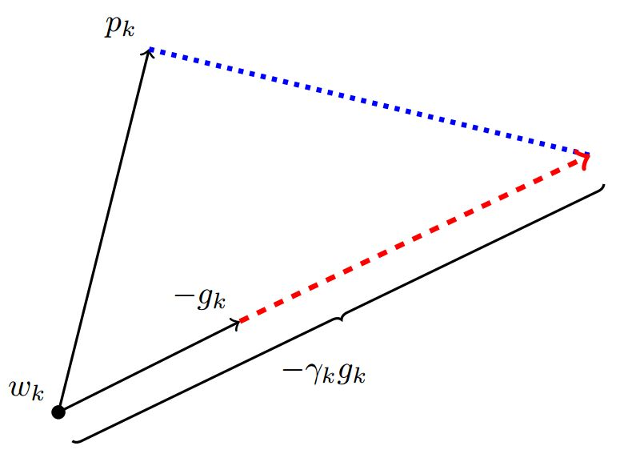

将优化算法的框架搬来. 首先定义符号. $$w$$为待优化参数, $$f(w)$$为目标函数, $$\alpha$$为初始学习率.

在每步$$t$$中:

1. 计算目标函数关于当前参数$$w_t$$的梯度: $$g_{t}=\nabla f\left(w_{t}\right)$$
2. 根据历史梯度$$g_{1}, g_{2}, \cdots, g_{t}$$计算一阶动量和二阶动量: $$m_{t}=\phi\left(g_{1}, g_{2}, \cdots, g_{t}\right)$$; $$V_{t}=\psi\left(g_{1}, g_{2}, \cdots, g_{t}\right)$$
3. 计算当前时刻的下降梯度: $$\eta_{t}=\alpha \cdot m_{t} / \sqrt{V_{t}}$$
4. 根据下降梯度更新参数: $$w_{t+1}=w_{t}-\eta_{t}$$

# Adam

Adam(Adaptive Moment Estimation)将一阶动量和二阶动量集合起来, Adam即Adaptive + Momentum.

一阶动量和二阶动量分别为:

$$m_{t}=\beta_{1} \cdot m_{t-1}+\left(1-\beta_{1}\right) \cdot g_{t}$$

$$V_{t}=\beta_{2} * V_{t-1}+\left(1-\beta_{2}\right) g_{t}^{2}$$

引入了两个超参数$$\beta_1$$和$$\beta_2$$, 分别控制一阶动量和二阶动量的影响. 实际使用过程中, 参数的经验值是:

$$\beta_{1}=0.9, \beta_{2}=0.999$$

为防止在训练起始阶段一阶二阶动量失真, 一般使用偏差修正过的指数移动平均值:

$$
\begin{aligned}
&\tilde{m}_{t}=m_{t} /\left(1-\beta_{1}^{t}\right)\\
&\tilde{V}_{t}=V_{t} /\left(1-\beta_{2}^{t}\right)
\end{aligned}
$$

## Adam的优点

Adam继承了Adagrad自适应学习率的特性, 对于稀疏梯度处理较好. 对于大多情况, 可以使用Nadam取得更好的效果.

## Adam的问题

### 可能不收敛

论文[On the Convergence of Adam and Beyond](https://openreview.net/forum?id=ryQu7f-RZ)探讨了Adam算法的收敛性, 通过反例证明了Adam在某些情况下可能会不收敛.

这是由于会发生**学习率震荡**的现象. 考虑优化算法的学习率为$$\alpha / \sqrt{V_{t}}$$, 只有在两种情况下, 学习率是单调递减的:

- SGD结合采用学习率衰减策略
- AdaGrad, 其二阶动量不断累积, 单调递增, 导致学习率单调递减

学习率是单调递减的, 最终收敛到0, 模型也得以收敛(虽然这种递减可能会引起训练提前停止的问题). 但Adam中的学习率主要是由二阶动量控制的, 二阶动量是固定时间窗口内的累积, 随着时间窗口的变化, 遇到的数据可能发生巨变, 使得$$V_t$$可能会时大时小, 不是单调变化. 这就可能在训练后期引起学习率的震荡, 导致模型无法收敛.

修正的方法, 对二阶动量的变化进行控制, 避免上下波动, 保证$$\left\|V_{t}\right\| \geq\left\|V_{t-1}\right\|$$, 使得学习率单调递减:

$$V_{t}=\max \left(\beta_{2} * V_{t-1}+\left(1-\beta_{2}\right) g_{t}^{2}, V_{t-1}\right)$$

### 可能错过全局最优解

论文[The Marginal Value of Adaptive Gradient Methods in Machine Learning](https://arxiv.org/abs/1705.08292)讲到具有自适应学习率的优化算法, 可能会对前期出现的特征过拟合, 后期才出现的特征很难纠正前期的拟合效果.

论文[Improving Generalization Performance by Switching from Adam to SGD](https://arxiv.org/abs/1712.07628)在CIFAR-10数据集上进行了实验, 发现Adam在后期的学习率太低, 影响了有效的收敛. 对Adam的学习率的下界进行控制, 发现效果好了很多.

这是两种影响Adam错过全局最优解的原因.

**一个有效的改进方法是**: 在训练的前期使用Adam, 享受Adam快速收敛的优势, 后期切换到SGD, 慢慢寻找最优解. 这个切换点可以根据经验人工进行, 而论文[Improving Generalization Performance by Switching from Adam to SGD](https://arxiv.org/abs/1712.07628)也给出了一种自动切换的方法.

## Adam+SGD

先用Adam快速下降, 再用SGD调优. 这种思路有两个技术问题:

- 什么时候切换优化算法
- 切换算法以后用什么样的学习率. Adam用的是自适应学习率, SGD接着训练的话, 用什么样的学习率

**切换后使用什么样的学习率?**

对于第二个问题, Adam和SGD的下降方向分别为:

$$\eta_{t}^{A d a m}=(\alpha / \sqrt{V_{t}}) \cdot m_{t}$$

$$\eta_{t}^{S G D}=\alpha^{S G D} \cdot g_{t}$$

那么$$\eta_{t}^{S G D}$$必定可以分解为$$\eta_{t}^{A d a m}$$所在方向及其正交方向上的两个方向之和:

上图中$$p$$为Adam的下降方向, $$g$$为SGD优化算法求得的梯度方向, $$\gamma$$为SGD的学习率.

$$\eta_{t}^{S G D}$$在$$\eta_{t}^{A d a m}$$方向上的投影, 就意味着SGD在Adam算法决定的下降方向上前进的距离, 而在$$\eta_{t}^{A d a m}$$正交方向上的投影是SGD在自己选择的修正方向上前进的距离. 因此, 如果SGD要走完Adam未走完的路, 需要先沿着$$\eta_{t}^{A d a m}$$方向走一步, 然后沿着其正交方向上再走一步.

那么SGD的学习率(步长)可以如下参考确定. **SGD在Adam下降方向上的正交投影, 应该正好等于Adam的下降方向**, 即:

$$\operatorname{proj}_{\eta_{t}^{S G D}}=\eta_{t}^{A d a m}$$

求解上面的方程, 就能得到SGD的学习率:

$$\alpha_{t}^{S G D}=\left(\left(\eta_{t}^{A d a m}\right)^{T} \eta_{t}^{A d a m}\right) /\left(\left(\eta_{t}^{A d a m}\right)^{T} g_{t}\right)$$

为了减少噪声影响, 作者使用移动平均值来修正对学习率的估计:

$$
\begin{array}{l}
\lambda_{t}^{S G D}=\beta_{2} \cdot \lambda_{t-1}^{S G D}+\left(1-\beta_{2}\right) \cdot \alpha_{t}^{S G D} \\
\tilde{\lambda}_{t}^{S G D}=\lambda_{t}^{S G D} /\left(1-\beta_{2}^{t}\right)
\end{array}
$$

这里直接复用了Adam的$$\beta_{2}$$超参数.

**什么时候进行切换?**

在整个优化过程中, 即使是使用Adam的阶段, 一直计算上式中的$$\tilde{\lambda}_{t}^{S G D}$$.  SGD的相应学习率的移动平均值基本不变的时候:

$$\left|\tilde{\lambda}_{t}^{S G D}-\alpha_{t}^{S G D}\right|<\varepsilon$$

那么就由Adam切换到SGD, 并以$$\tilde{\lambda}_{t}^{S G D}$$的学习率继续训练.

## Nadam

Adam集成了一阶动量和二阶动量, 具有很好的特性. Nadam是在Adam的基础上, 进一步集成了NAG(Nesterov Accelerated Gradient), **Nadam = Nesterov + Adam**.

$$g_{t}=\nabla f\left(w_{t}-\alpha \cdot m_{t-1} / \sqrt{V_{t-1}}\right)$$

# 参考资料

- [一个框架看懂优化算法之异同 SGD/AdaGrad/Adam](https://zhuanlan.zhihu.com/p/32230623)
- [Adam那么棒，为什么还对SGD念念不忘 (2)—— Adam的两宗罪](https://zhuanlan.zhihu.com/p/32262540)
- [Adam那么棒，为什么还对SGD念念不忘 (3)—— 优化算法的选择与使用策略](https://zhuanlan.zhihu.com/p/32338983)
