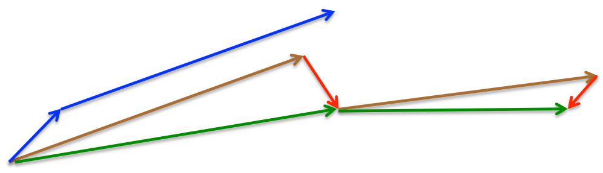

将优化算法的框架搬来. 首先定义符号. $$w$$为待优化参数, $$f(w)$$为目标函数, $$\alpha$$为初始学习率.

在每步$$t$$中:

1. 计算目标函数关于当前参数$$w_t$$的梯度: $$g_{t}=\nabla f\left(w_{t}\right)$$
2. 根据历史梯度$$g_{1}, g_{2}, \cdots, g_{t}$$计算一阶动量和二阶动量: $$m_{t}=\phi\left(g_{1}, g_{2}, \cdots, g_{t}\right)$$; $$V_{t}=\psi\left(g_{1}, g_{2}, \cdots, g_{t}\right)$$
3. 计算当前时刻的下降梯度: $$\eta_{t}=\alpha \cdot m_{t} / \sqrt{V_{t}}$$
4. 根据下降梯度更新参数: $$w_{t+1}=w_{t}-\eta_{t}$$

# SGD

SGD(stochastic gradient descent)更多地指mini-batch gradient descent. 作为最基础的优化算法, 原理就是计算这个mini-batch的梯度, 然后对参数进行更新.

$$
\begin{aligned}
&g_{t}=\nabla_{w_{t-1}} f\left(w_{t-1}\right)\\
&\eta_{t}=-\alpha * g_{t}
\end{aligned}
$$

从框架的角度讲, SGD没有动量的概念, 即:

$$m_t=g_t$$; $$V_t=I^2$$

代入步骤3, 得到$$\eta_t=\alpha\cdot g_t$$

## 缺点

- SGD最大的缺点是**下降速度慢**, 收敛慢
- 可能会在损失函数的鞍点沟壑两边持续震荡, 进一步降低了收敛速度

## SGD与极值和鞍点

一种常见的关于SGD的认知错误, 即SGD容易陷入到局部最小值(local minima)中, 从而再也无法跳出. 而这时人们**把低维的直观认识直接推到高维**造成的.

但2014年论文[Identifying and attacking the saddle point problem in high-dimensional non-convex optimization](https://arxiv.org/abs/1406.2572v1)分析得出, 对于**高维优化问题**, 根本没有这么多局部极小值. 之所以非凸优化问题难以解决, 是因为存在大量的鞍点(梯度为零并且Hessian矩阵特征值有正有负). 在鞍点附近, 基于梯度的优化算法都会遇到严重的问题.

鞍点存在一个区域, 这个区域非常平坦, 梯度很小. SGD在迭代过程中, 在鞍点附近的变化幅度越来越小, 看起来像是静止卡住了. 但与local minima不同, 如果运行时间足够长, SGD一类的算法是可以走出鞍点附近的.

附上经典鞍点图:

因此, 使用梯度优化神经网络的主要问题是存在**大量鞍点**, 在高维的情况下, 鞍点附近的平坦区域可能非常大; 另外鞍点的数量可能非常多, 即便跳过一个鞍点, 很快就会进入到另外一个鞍点的平坦区域.

详见[知乎](https://www.zhihu.com/question/52782960/answer/133724696).

## SGD with Momentum

SGDM加入了动量(Momentum), 即惯性, 已抑制SGD的震荡, 加快收敛. 另外在下坡时, 利用惯性下降的更快一些, 也加快了收敛的速度. 引入一阶动量:

$$m_{t}=\beta_{1} \cdot m_{t-1}+\left(1-\beta_{1}\right) \cdot g_{t}$$

$$\eta_t=\alpha\cdot m_t$$

这样得到的一阶动量, 是各个时刻梯度的**指数移动平均值**, 约等于最近$$\frac{1}{1-\beta_1}$$个时刻内的梯度向量的平均值.

因此在$$t$$时刻, 下降方向不仅由当前点的梯度方向决定, 还由此前积累的动量方向决定. 一般$$\beta_1$$取0.9, 因此下降方向更多是由动量方向决定的.

在迭代过程中, 在鞍点区域震荡时, 依靠积累的动量, 跳出震荡的局面.

## SGD with Nesterov Acceleration

NAG(Nesterov Accelerated Gradient)在动量上更进一步. 其最终的下降方向依然由梯度主导, 但还将动量引入到当前时间梯度的计算当中. 由于下降方向由动量主导, 所以先沿着动量走一步, 到达新的位置, 然后对新位置求得梯度, 将这个梯度叠加在梯度上, 进行校正, 提高了梯度更新的灵敏度.

momentum首先计算一个梯度(短的蓝色向量), 然后在动量方向进行一个大的跳跃(长的蓝色向量); nesterov项首先在之前动量方向进行一个大的跳跃(棕色向量), 然后计算梯度(红色向量), 进行校正, 得到最终的一步(绿色向量).

因此整个过程可以表示为:

$$g_{t}=\nabla f\left(w_{t}-\alpha \cdot m_{t-1} \right)$$

$$m_{t}=\beta_{1} \cdot m_{t-1}+\left(1-\beta_{1}\right) \cdot g_{t}$$

$$\eta_t=\alpha\cdot m_t$$

# 指数移动平均值的偏差修正

计算指数移动平均值得到一阶变量:

$$m_{t}=\beta_{1} \cdot m_{t-1}+\left(1-\beta_{1}\right) \cdot g_{t}$$

初始化$$m_{0} = 0$$, 由于$$\beta_1$$的值一般取接近1的值, 因此在初期, $$m_{t}$$的值都会很小. 这样的值去更新梯度是有问题的, 因此常常使用下式进行修正:

$$\tilde{m}_{t}=m_{t} /\left(1-\beta_{1}^{t}\right)$$
