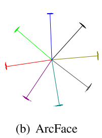

ArcFace, CosFace, 和SphereFace三者都是Softmax Loss的改进. 最初都是在人脸识别领域使用. Softmax Loss有着如下的缺点:

- 使用分类的方式进行人脸识别都会遇到训练和测试不一致的问题. 例如使用10万张人脸数据进行训练, 但是在应用时可能对几百个, 或几百万人脸进行识别. 而使用Softmax Loss训练得到的feature embedding, 在test阶段, 同一类中的样本不能很好的聚集在一起, 即类别之前的区分程度不足
- Softmax Loss在输出层引入的参数$$W$$是与分类类别线性相关的, 对于人脸识别这种类别数量很多的情景, 会导致输出层的linear transformation matrix中的参数数量过多

因此, ArcFace, CosFace, 和SphereFace都是为了提成对不同类别的区分能力诞生的.

# Softmax Loss

首先来看最常用的Softmax Loss:

$$L_{1}=-\frac{1}{N} \sum_{i=1}^{N} \log \frac{e^{W_{y_{i}}^{T} x_{i}+b_{y_{i}}}}{\sum_{j=1}^{n} e^{W_{j}^{T} x_{i}+b_{j}}}$$

第$$i$$个样本$$x_{i} \in \mathbb{R}^{d}$$属于第$$y_i$$类. $$W_{j} \in \mathbb{R}^{d}$$是$$W \in \mathbb{R}^{d \times n}$$的第$$j$$列, 代表着第$$j$$类的参数. Batch size大小为$$N$$, 类别的数量为$$n$$.

但softmax loss不能够保证, 同类样本的feature embedding相似, 不同类样本的feature embedding具有明显的差异性.

---

换个角度来看softmax loss. 假设softmax loss公式中的所有bias $$b_j=0$$, 然后我们就能将第$$j$$类的logit表示为:

$$W_{j}^{T} x_{i}=\left\|W_{j}\right\|\left\|x_{i}\right\| \cos \theta_{j}$$

其中$$W_{j}^{T} x_{i}=\left\|W_{j}\right\|\left\|x_{i}\right\| \cos \theta_{j}$$, $$\theta_{j}$$是参数向量$$W_{j}$$和feature向量$$x_{i}$$之间的夹角.

然后, 使用 $$l_2$$ normalization 对参数向量进行约束$$||W_{j}||=1$$. 也对embedding feature的模长 $$||x_j||$$ 进行$$l_2$$ normalization, 然后re-scale到$$s$$长度.

通过对参数向量和feature向量的模长进行约束, 此时的logit就只取决于两者之间的角度了:

$$
\begin{aligned}
L_{2}=-\frac{1}{N} \sum_{i=1}^{N} \log \frac{e^{s \cos \theta_{y_{i}}}}{e^{s \cos \theta_{y_{i}}}+\sum_{j=1, j \neq y_{i}}^{n} e^{s \cos \theta_{j}}}
\end{aligned}
$$

由于feature向量的模长被限制在$$s$$, 则feature embedding将会分布在半径为$$s$$的超球面上. 同类样本的feature向量会分布在以参数向量为中心的周围.

# ArcFace

为了让同类样本的embedding更加近似, 不同类样本差异更大, 给参数向量$$W_{j}$$和feature向量$$x_{i}$$之间的夹角增加一个角度惩罚项$$m$$, 得到ArcFace:

$$
\begin{aligned}
L_{3}=-\frac{1}{N} \sum_{i=1}^{N} \log \frac{e^{s\left(\cos \left(\theta_{y_{i}}+m\right)\right)}}{e^{s\left(\cos \left(\theta_{y_{i}}+m\right)\right)}+\sum_{j=1, j \neq y_{i}}^{n} e^{s \cos \theta_{j}}}
\end{aligned}
$$

由于惩罚项的存在, 样本向量与其对应类别的参数向量将更加贴近.

# SphereFace

SphereFace与ArcFace的逻辑类似, 但操作方法不同.

以二分类为例, 1类, 2类. 对于1类样本, 正确分类的要求为$$\cos\theta_1 \gt \cos\theta_2$$, 即样本的feature向量与类别1参数向量之间的角度更小. 而为了增强不同类别之间feature embedding之间的区分性, 要求样本与正确分类的参数向量之间的角度要远小于与其他类别的角度, 即$$\theta_1 \lt \theta_2 /m$$, 因此需要$$\cos m \theta_1 \gt \cos\theta_2$$, 所以SphereFace为:

$$
\begin{aligned}
L_{3}=-\frac{1}{N} \sum_{i=1}^{N} \log \frac{e^{s\left(\cos \left(m\theta_{y_{i}}\right)\right)}}{e^{s\left(\cos \left(m\theta_{y_{i}}\right)\right)}+\sum_{j=1, j \neq y_{i}}^{n} e^{s \cos \theta_{j}}}
\end{aligned}
$$

论文中关于同类相似, 异类分异的试验直观表现:

# CosFace

CosFace使用更直接的**余弦间隔**. 还是以二分类为例, 与SphereFace不同, CosFace引入cosine margin, 让当前样本所属的类别在减去一个m之后仍然属于这个类别:

$$\cos \left(\theta_{1}\right)-m>\cos \left(\theta_{2}\right)$$

因此, CosFace为:

$$
\begin{aligned}
L_{4}=-\frac{1}{N} \sum_{i=1}^{N} \log \frac{e^{s\left(\cos \left(\theta_{y_{i}}\right)-m\right)}}{e^{s\left(\cos \left(\theta_{y_{i}}\right)-m\right)}+\sum_{j=1, j \neq y_{i}}^{n} e^{s \cos \theta_{j}}}
\end{aligned}
$$

# 总结

ArcFace, CosFace, SphereFace三者非常类似, 都是在直接或间接的引入**angular margin**.

可以将三种惩罚方式综合在一起, 得到:

$$\left(\cos \left(m_{1} \theta+m_{2}\right)-m_{3}\right)$$

其中:

- $$m_1$$是SphereFace中的multiplicative angular margin
- $$m_2$$是ArcFace中的additive angular margin
- $$m_3$$是CosFace中的additive cosine margin

对应的损失函数表达为:

$$
\begin{aligned}
L=-\frac{1}{N} \sum_{i=1}^{N} \log \frac{e^{s\left(\cos \left(m_{1} \theta_{y_{i}}+m_{2}\right)-m_{3}\right)}}{e^{s\left(\cos \left(m_{1} \theta_{y_{i}}+m_{2}\right)-m_{3}\right)}+\sum_{j=1, j \neq y_{i}}^{n} e^{s \cos \theta_{j}}}
\end{aligned}
$$

每种方法都会增大同类的相似度, 加大不同类之间的差异.

下图右侧是多种损失函数下得到的target logit与角度之间的关系, 可以看到在相同logit下, 使用三种损失函数得到的角度都会比softmax loss小很多, 可见类别内的相似度得到了加强. 左图是训练的不同阶段角度的分布情况.

下图是三种损失函数对应的二分类**决策边界**(decision boundaries). ArcFace一个优异的性质为, 在任何情况下, 不同类的决策边界之间的距离是线性的, 或者说是常数.

# 参考资料

- [ArcFace: Additive Angular Margin Loss for Deep Face Recognition](https://arxiv.org/abs/1801.07698)
- [SphereFace: Deep Hypersphere Embedding for Face Recognition](https://arxiv.org/abs/1704.08063)
- [CosFace: Large Margin Cosine Loss for Deep Face Recognition](https://arxiv.org/abs/1801.09414)
