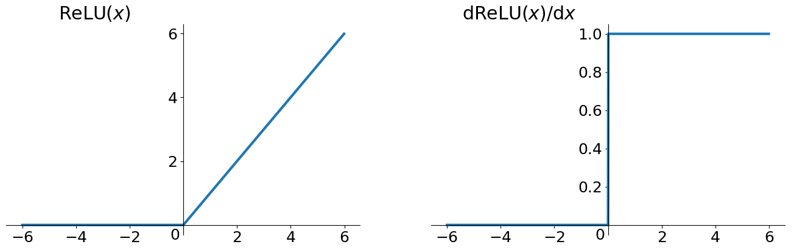
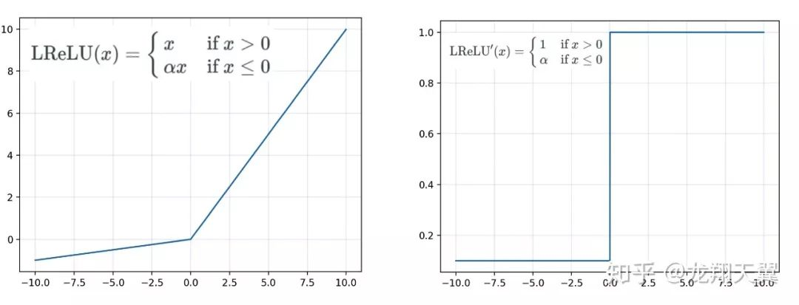
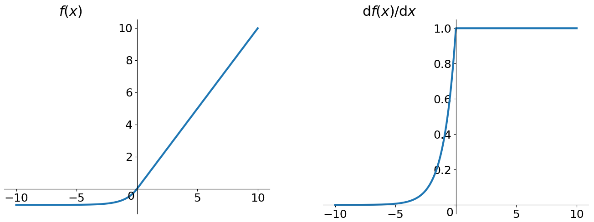

ReLU(Rectified Linear Unit), 整流线性单元, 是现在常见的激活函数, 并且有多种优化版本. 函数本身十分简单:

$$
f(x)=\left\{\begin{array}{lll}
{x}, & {x \geq 0} \\
{0}, & {x<0}
\end{array}\right.=\max (x, 0)
$$

对应的导数为:

$$
f(x)^{\prime}=\left\{\begin{array}{lll}
{1}, & {x \geq 0} \\
{0}, & {x<0}
\end{array}\right.
$$

对应的函数图和导数图:

### 优点

- 导数在正半轴恒为1, 因此解决了因为链式求导这部分的梯度消失问题, **但仍然存在梯度消失问题**, 原因见下
- 计算简单, 网络效率高
- 每层的输出具有**稀疏性**

### 缺点

#### Dying ReLU

最大的缺点为**dying ReLU**问题, 即在训练过程中, 网络的部分参数对于几乎任何输入, 神经元的输出和梯度都为0, 神经元处于僵死的状态. 随着训练的推进, 每层都有僵死的神经元, 而层数的推进造成僵死现象叠加愈发严重, 最终也无法训练深层的网络. 可以参考: [What is the “dying ReLU” problem in neural networks?](https://datascience.stackexchange.com/questions/5706/what-is-the-dying-relu-problem-in-neural-networks).

为了理解其产生的原因, 从后向传播开始. 假设使用一个非常简单的线性损失函数:

$$\text {error}=R e L U-y$$

同时对于当前层的前向传播有:

$$z_{n}=\sum_{i=0}^{k} w_{i} a_{i}^{n}$$

其中$$a_{i}^{n}$$是**上一层**的输出, 当前层的输入, $$z_{n}$$即是输入到当前层ReLU激活函数的内容. 这样对应的梯度为:

$$
\frac{\partial e r r o r}{\partial z_{n}}=\delta_{n}=\left\{\begin{array}{ll}
{1} & {z_{n} \geq 0} \\
{0} & {z_{n}<0}
\end{array}\right.
$$

其实不仅仅对于简单的线性损失函数, 对于其他常用的损失函数仍然会得到如上的只有两种值的梯度, 0是永恒的, 1可能会变化为其他的数值.

而当前层参数$$w_j$$对应的梯度为:

$$
\nabla \text {error}=\frac{\partial e r r o r}{\partial w_{j}}=\frac{\partial e r r o r}{\partial z_{n}} \times \frac{\partial z_{n}}{\partial w_{j}}=\delta_{n} \times a_{j}^{n}=\left\{\begin{array}{ll}
{a_{j}^{n}} & {z_{n} \geq 0} \\
{0} & {z_{n}<0}
\end{array}\right.
$$

当梯度为0时, 对应的参数因此就不会得到更新, 整个网络也就没有在学习. 而使得梯度为0就要求$$z_{n}$$的值对于任何输入一直小于0, 而这常常是由于某些input batch使得网络的参数值变得很小, 使得$$z_n$$的输出小于0, 而一旦陷入这个问题, 就很难再出来了, 因为网络得不到更新.

另外, **大的学习率**往往会引起或加剧这个问题. 梯度更新的步幅过大, 使得网络中的神经元转为dying neuron. 因此在训练ReLU为激活函数的网络时, 最好使用较小的学习率.

#### RNN中使用ReLU导致梯度爆炸

参考: [RNN 中为什么要采用 tanh，而不是 ReLU 作为激活函数？](https://www.zhihu.com/question/61265076/answer/186347780)

### 改进

#### Leaky ReLU

Leaky ReLU是为了解决Dying ReLU问题而进行的改进. 不再有饱和区, 负轴的输出值不再为0, 整个函数是由两端线性函数拼接而成.

相对于ReLU, 优点有:

- $$x$$小于0时的输出与梯度不再为0, 解决dying ReLu问题
- 有负值输出, zero-centered, 能帮助网络向正确的方向推动权重和偏置变化

缺点:

- 引入了超参数$$\alpha$$, 通常取0.01, 需要人工调参设定
- 实际操作中, 并没有明显优于ReLU

#### ELU

ELU(Exponential Linear Units)函数, 也是为了解决ReLU的Dying ReLU问题而进行的改进.

$$
\operatorname{ELU}(x)=\left\{\begin{array}{ll}
{x} & {\text { if } x>0} \\
{\alpha\left(e^{x}-1\right)} & {\text { if } x<0}
\end{array}\right.
$$

$$
\mathrm{ELU}^{\prime}(x)=\left\{\begin{array}{ll}
{1} & {\text { if } x>0} \\
{\mathrm{ELU}(x)+\alpha} & {\text { if } x \leq 0}
\end{array}\right.
$$

与Leaky ReLU相比, 负半轴由直线变成了曲线. 优缺点类似于Leaky ReLU, 但存在计算量大的问题(幂计算). 并且也需要指定超参数.

#### PReLU

PReLU(Parametric Rectified Linear Unit)在形式上与上面两种改进的ReLU都类似. Leaky ReLU与ELU都需要人工指定超参数$$\alpha$$, 但PReLU将超参数$$\alpha$$作为可训练的参数, 避免了对激活函数中超参数的调参.

PReLU的提出是结合CNN的. PReLU函数的定义如下

$$
f\left(y_{i}\right)=\left\{\begin{array}{ll}
{y_{i},} & {\text { if } y_{i}>0} \\
{a_{i} y_{i},} & {\text { if } y_{i} \leq 0}
\end{array}\right.
$$

输入到激活函数中的$$y_i$$表示第$$i$$个**输出**通道, $$y_i$$其实对应更常用的$$z_i$$. $$a_i$$是控制这一通道负半轴的斜率参数, 在训练中更新. 因此不同的输出通道对应着不同的斜率参数.

这样的确引入了额外的网络参数, 但由于每一层增加了相应通道数的参数, 相比于原本的参数量是可以忽略不计的.

参数$$a$$的更新策略与普通参数相同, 对于每步训练, 首先得到对应的导数:

$$
\frac{\partial \mathcal{E}}{\partial a_{i}}=\sum_{y_{i}} \frac{\partial \mathcal{E}}{\partial f\left(y_{i}\right)} \frac{\partial f\left(y_{i}\right)}{\partial a_{i}}
$$

$$\frac{\partial \mathcal{E}}{\partial f\left(y_{i}\right)}$$是损失对激活函数输出值的偏导, 而激活函数的输出对输入的导数为:

$$
\frac{\partial f\left(y_{i}\right)}{\partial a_{i}}=\left\{\begin{array}{ll}
{0,} & {\text { if } y_{i}>0} \\
{y_{i},} & {\text { if } y_{i} \leq 0}
\end{array}\right.
$$

导数公式中$$\sum y_{i}$$指的是对应层输出中的所有位置得到的值的累加. 最后, 如同普通参数一样更新:

$$
\Delta a_{i}:=\mu \Delta a_{i}+\epsilon \frac{\partial \mathcal{E}}{\partial a_{i}}
$$

在`Keras`的实现中, PReLU默认会对输出的每个位置都设定一个独立的可训练斜率参数, 例如对于2D-CNN网络, 当前层的输出为`(batch, height, width, channels)`, 默认每个通道的每个位置的斜率参数都是独立的. 如果想实现通道内共享同一斜率参数, 可以在定义时使用`shared_axes`参数指定共享参数的维度, 指定为`[1, 2]`即每个通道共享同一参数.

PReLU来自论文[Delving Deep into Rectifiers: Surpassing Human-Level Performance on ImageNet Classification](https://arxiv.org/abs/1502.01852).
