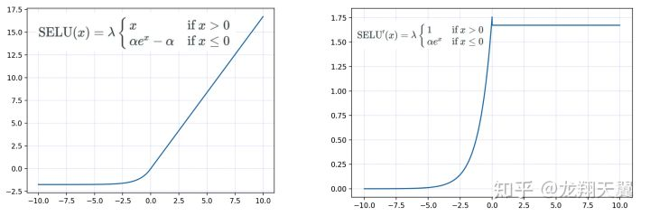

SELU(scaled exponential linear units)源自论文[Self-Normalizing Neural Networks](http://arxiv.org/abs/1706.02515). 作者提出这个激活函数是为了在FNN中实现自己定义的`self-normalization`, 以解决FNN表现差的问题.

函数表示为:

$$
\operatorname{selu}(x)=\lambda\left\{\begin{array}{ll}
{x} & {\text { if } x>0} \\
{\alpha e^{x}-\alpha} & {\text { if } x \leqslant 0}
\end{array}\right.
$$

对应图像为:

其实就是在`ELU`激活函数上乘了个$$\lambda$$, 要求$$\lambda$$是大于1的.

论文中作者认为好的激活函数应当具有以下特点:

- 能够输出正值和负值, 可以做到输出的期望均值在0左右
- 具有饱和区域, 对应的导数约为0. 这样在较浅的层中, 对于输出方差过大的情况, 能够缓和这种情况
- 斜率应当大于1, 这样在浅层中, 如果输出的方差过小, 能够增大方差
- 是一个连续的曲线

最终使得FNN达到`self-normalization`的状态, 即每层的输出能够满足均值为0, 方差为1, 得到类似于batch normalization的效果. 达到**避免梯度消失和梯度爆炸**的效果.

---

考虑某一层, 该层的参数为$$\boldsymbol{W}$$, 该层的输入/上一层的输出为$$\boldsymbol{x}$$, 输入到激活函数的值为$$\boldsymbol{z}=\boldsymbol{W} \boldsymbol{x}$$, 激活函数的输出为$$\boldsymbol{y}=f(\boldsymbol{z})$$. 每一层的输入输出都是随机变量, 则输入向量$$\boldsymbol{x}$$中每个元素分布的定义为$$\mu:=\mathrm{E}\left(x_{i}\right)$$, 方差定义为$$\nu:=\operatorname{Var}\left(x_{i}\right)$$, 输出的均值和方差定义为$$\tilde{\mu}:=\mathrm{E}(y)$$和$$\tilde{\nu}:=\operatorname{Var}(y)$$.

对于单个输出值$$y=f(z)$$, 其中$$z=\boldsymbol{w}^{T} \boldsymbol{x}$$. 该神经元对应的参数向量$$\boldsymbol{w}$$长度与输入向量$$\boldsymbol{x}$$相同, 假设长度为$$n$$, 定义两个变量$$\omega:=\sum_{i=1}^{n} w_{i}$$和$$\tau:=\sum_{i=1}^{n} w_{i}^{2}$$, 分别为参数向量中每个值的均值乘以$$n$$, 以及方差乘以$$n$$.

定义映射关系$$g$$, 映射输入的均值和方差到输出的均值和方差, 这个关系由该层的参数决定, 表示为:

$$
\left(\begin{array}{c}
{\mu} \\
{\nu}
\end{array}\right) \mapsto\left(\begin{array}{c}
{\tilde{\mu}} \\
{\tilde{\nu}}
\end{array}\right): \quad\left(\begin{array}{c}
{\tilde{\mu}} \\
{\tilde{\nu}}
\end{array}\right)=g\left(\begin{array}{c}
{\mu} \\
{\nu}
\end{array}\right)
$$

使用常见的正则化方法(batch, layer, weight normalization)对应于$$g$$, 这里的$$g$$使得输入输出的方差和均值能够保持不变, 一般为$$(0, 1)$$.

以上为必要的定义, 然后就可以定义作者所说的`Self-normalizing`概念了.

首先定义均值和方差的值域$$\Omega=\left\{(\mu, \nu) | \mu \in\left[\mu_{\mathrm{min}}, \mu_{\max }\right], \nu \in\right.\left.\left[\nu_{\min }, \nu_{\max }\right]\right\}$$, 如果一个网络是满足`Self-normalizing`的, 应当满足:

- 对于**单个神经元**, 其输出值与输入向量的均值和方差是没有变化的, 即$$g: \Omega \mapsto \Omega$$. 这个关系是依赖于该神经元的参数向量, 等同于依赖$$(\omega, \tau)$$
- 

