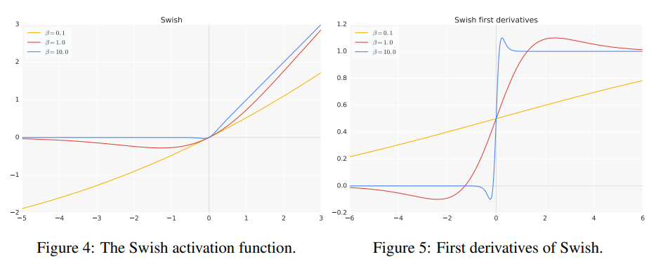

Swish激活函数来自论文[Searching for Activation Functions](https://arxiv.org/abs/1710.05941v2). Swish定义为:

$$\operatorname{Swish}(x) = x \sigma(\beta x)$$

其中的$$\sigma$$是`sigmoid`函数$$\sigma(z)=(1+\exp (-z))^{-1}$$. $$\beta$$即可以是指定的一个常数, 也可以是一个可训练的参数(训练方法参考PReLU激活函数). 不同$$\beta$$下函数和导数如下图:

事实上, 如果$$\beta=0$$, Swish将退化成线性函数$$f(x)=\frac{x}{2}$$, 如果$$\beta \rightarrow \infty$$, Swich十分接近于ReLU函数. 因此, 可以说Swich函数根据$$\beta$$的不同, 是线性函数和ReLU函数之间的**非线性差值**.

Swish的导数为:

$$
\begin{aligned}
f^{\prime}(x) &=\sigma(\beta x)+\beta x \cdot \sigma(\beta x)(1-\sigma(\beta x)) \\
&=\sigma(\beta x)+\beta x \cdot \sigma(\beta x)-\beta x \cdot \sigma(\beta x)^{2} \\
&=\beta x \cdot \sigma(x)+\sigma(\beta x)(1-\beta x \cdot \sigma(\beta x)) \\
&=\beta f(x)+\sigma(\beta x)(1-\beta f(x))
\end{aligned}
$$

从导数图中可以看出, 参数$$\beta$$控制了一阶导数从0到1变化的速度.

**在实践中, 通常选择$$\beta=1$$**.

### Swish的特点

- 无上界, 有下界
- 非单调
- 曲线平滑, 一阶导平滑

**缺点**:

- 计算量大
