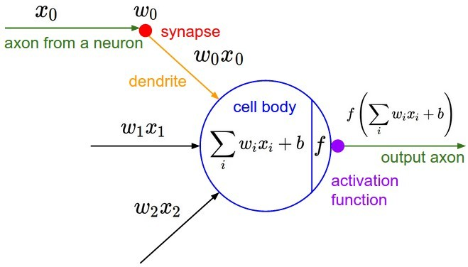

# 梯度消失

一般对梯度消失的认识是从网络层数加深开始的. 随着网络的加深FNN这种形式的网络很快就无法训练了. 因此这里从FNN网络开始切入.

## FNN中的梯度消失

考虑一个神经元, 记$$a^{l}$$为第$$l$$层的输出, $$z^{l}$$为第$$l$$层输入到激活函数中的输入:

记损失函数为$$L$$, 我们考虑一个4层的FNN网络. 对于第4层的参数$$w^{4}$$, 对应的导数为:

$$\frac{\partial L}{\partial w^{4}}=\frac{\partial L}{\partial a^{4}} \frac{\partial a^{4}}{\partial z^{4}} \frac{\partial z^{4}}{\partial w^{4}}$$

而通过链式求导法则, 可以得到对于第1层参数$$w^{1}$$的导数为:

$$\frac{\partial L}{\partial w^{(1)}}=\underbrace{\frac{\partial L}{\partial a^{(4)}} \frac{\partial a^{(4)}}{\partial z^{(4)}}}_{\text {From } w^{(4)}} \underbrace{\frac{\partial z^{(4)}}{\partial a^{(3)}} \frac{\partial a^{(3)}}{\partial z^{(3)}}}_{\text {From } w^{(3)}} \underbrace{\frac{\partial z^{(3)}}{\partial a^{(2)}} \frac{\partial a^{(2)}}{\partial z^{(2)}}}_{\text {From } w^{(2)}} \frac{\partial z^{(2)}}{\partial z^{(1)}} \frac{\partial a^{(1)}}{\partial z^{(1)}} \frac{\partial z^{(1)}}{\partial w^{(1)}}$$

其中的$$\frac{\partial a^{(l)}}{\partial z^{(l)}}$$即为**激活函数**的导数. 对于FNN中经常使用的激活函数`sigmoid`或`tanh`, 其导数能取的最大值都是不大于1的, `sigmoid`函数的导数最大取值甚至只有`0.25`. 因此, 这一项的值都绝大部分时间都会在1以下. 而对于比较接近输入层的layer, 可以看到其导数中, 存在多个$$\frac{\partial a^{(l)}}{\partial z^{(l)}}$$, 连乘之后得到的值会很小, 而且会随着层数的加深愈发严重.

## 解决方法

1. 使用特殊的激活函数

    如果导数的激活函数的导数不小于1, 则就不会因链式求导导致梯度消失的问题. 因此`ReLU`, `leakyReLU`, `ELU`等激活函数可以用来解决梯度消失的问题

2. Batch Normalization

    将Batch Normalization作用到激活函数之前, 将激活函数的输入整合到均值为0, 标准差为1的分布, 这样使得激活函数的输入能够落在对输入比较敏感的区域, 避免落入饱和区

3. 残差结构

    残差结构带来的短路机制, 可以认为是多个网络结构的ensemble
