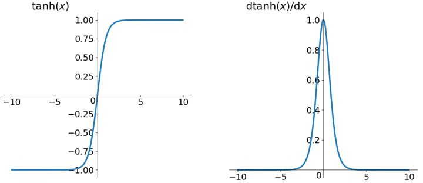

# 零中心(zero-centered)

上面为`Sigmoid`函数和`tanh`函数的函数图和导数图. 我们把tanh称为是零中心(zero-centered)的函数, 其输出值是单调且有正有负; `sigmoid`函数**非零中心**(non-zero-centered)的, 函数的输出只有正值.

如果激活函数是non-zero-centered的, 一般会导致**神经网络收敛较慢**.

## 收敛慢的原因

non-zero-centered激活函数会导致神经网络收敛较慢, 原理要从反向传播开始讲起.

损失函数为$$L$$, 对于某一参数$$w$$的更新公式为:

$$w \leftarrow w-\eta \cdot \frac{\partial L}{\partial w}$$

对于单个神经元, 其输入输出的关系为:

$$f(\vec{x} ; \vec{w}, b)=f(z)=f\left(\sum_{i} w_{i} x_{i}+b\right)$$

因此, 对于单个参数$$w_i$$来说, 通过链式求导法则, 其导数为:

$$\frac{\partial L}{\partial w_{i}}=\frac{\partial L}{\partial f} \frac{\partial f}{\partial z} \frac{\partial z}{\partial w_{i}}=x_{i} \cdot \frac{\partial L}{\partial f} \frac{\partial f}{\partial z}$$

其中的$$f$$是神经元的输出, 也通常记为$$a$$, $$\frac{\partial z}{\partial w_{i}}$$这一项的结果为$$x_i$$. 因此$$w_i$$的更新公式为:

$$w_{i} \leftarrow w_{i}-\eta x_{i} \cdot \frac{\partial L}{\partial f} \frac{\partial f}{\partial z}$$

参数$$w_i$$的**更新方向**是由$$x_{i} \cdot \frac{\partial L}{\partial f} \frac{\partial f}{\partial z}$$决定的. 而对于某个神经元相关的所有$$w_i$$来说, $$\frac{\partial L}{\partial f} \frac{\partial f}{\partial z}$$是一个常数, 因此某个神经元相关的所有参数的更新方向之间的差异, 完全是由$$x_i$$的符号决定的.

非零中心激活函数的弊端因此展现. 以`Sigmoid`函数为例, 并且我们分析一个简单的网络, 对于某个神经元, 其上一层只有两个输入, 即两个神经元, 即:

$$f(\vec{x} ; \vec{w}, b)=f\left(w_{0} x_{0}+w_{1} x_{1}+b\right)$$

对应的两个参数为$$w_0$$, $$w_1$$. 并假设当前时刻, 两个参数与最优解对应值的关系为:

$$
\left\{\begin{array}{l}
{w_{0}<w_{0}^{*}} \\
{w_{1} \geqslant w_{1}^{*}}
\end{array}\right.
$$

所以希望$$w_0$$适当的增大, 而$$w_1$$适当的减小, 要求$$w_0$$和$$w_1$$的符号相反.

但对于`Sigmoid`函数, 其输出值恒为正, 即输入的$$x_0$$和$$x_1$$恒为正, 因此两个参数的更新方向肯定是同时增大或减小的. 而模型为了收敛, 只能走Z字形逼近最优解, 导致迭代步骤的增加, 这种现象也称为zig-zagging dynamics.

# 参考资料

- [谈谈激活函数以零为中心的问题](https://liam.page/2018/04/17/zero-centered-active-function/)
- [训练深度神经网络尽量使用zero-centered数据呢？](https://www.zhihu.com/question/57194292)
