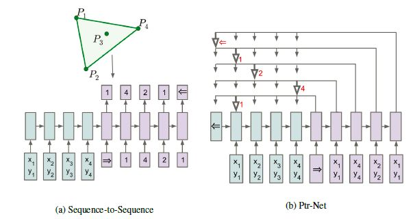
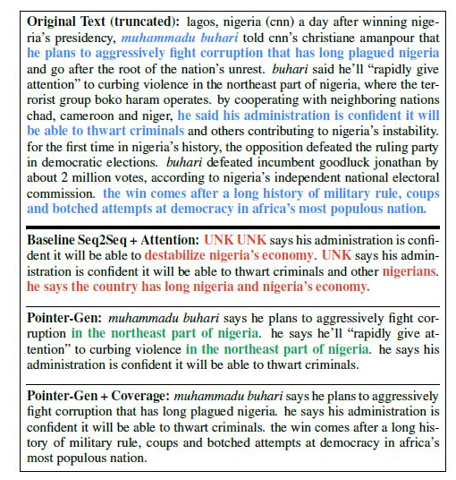
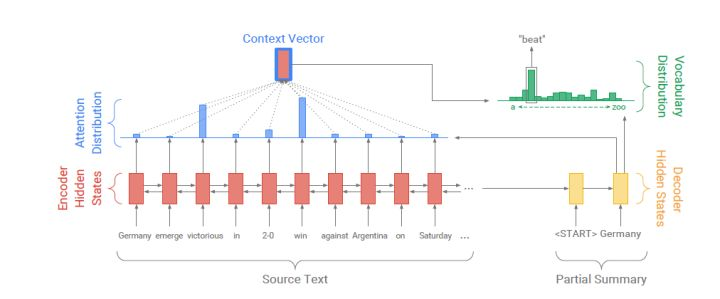
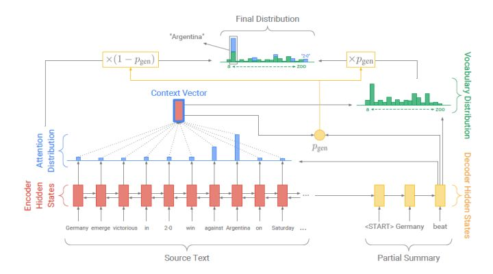

## 相关论文

- [Pointer Networks](https://arxiv.org/abs/1506.03134)
- [Get To The Point: Summarization with Pointer-Generator Networks](https://arxiv.org/abs/1704.04368)
- [Incorporating Copying Mechanism in Sequence-to-Sequence Learning](https://arxiv.org/abs/1603.06393)
- [Multi-Source Pointer Network for Product Title Summarization](https://arxiv.org/abs/1808.06885)

## 引入

**seq2seq**模型实现了把一个序列转换成另外一个序列的功能, **并且不要求输入序列和输出序列等长**, 比较典型的应用如**机器翻译**.

由于语言序列相关的任务都存在时序关系, 而RNN模型十分适合处理序列关系的任务. 这里就以RNN为例, 融合Pointer Networks方法进行介绍.

机器翻译任务, 如将序列`ABC`转换成序列`WXYZ`的过程如下图所示:

seq2seq模型分为encoder和decoder两部分, encoder部分接受`ABC`作为输入, 然后**将这个序列转换成为一个中间向量C**(这点与Transformer结构不同, Transformer仍然是一个序列结构), 向量C可以认为是对输入序列的一种理解和表示形式. decoderr部分把中间向量C作为自己的(部分)输入, 通过解码操作得到输出序列`WXYZ`.

以上只是一种简单的seq2seq模式, 对于不同的问题, 现在有多种形式的seq2seq模式, Pointer Networks的应用需要根据模型的结构进行灵活的调整应用.

Pointer Networks是通过对Attention机制进行简化得到的.

传统的seq2seq模型是无法解决输出序列的词汇表会随着输入序列长度的改变而改变的问题的. 例如对于翻译问题, 更长的原句往往表示着更复杂的意思, 整体看来, 输出的词汇表为了表达这种意思, 通常需要包含更多的词汇.

再例如一个**寻找凸包**的例子. 给定若干个点, 找到一个凸封闭的序列.

- 提供一个词汇表: `[start, 1, 2, 3, 4, end]`
- 需要预测的输出序列: `[start, 1, 4, 2, 1, end]`

但对于传统的seq2seq模型, 当它的**输入词汇表**已经限定, 对于寻找凸包的任务, 就是点的集合是固定的, 当输入序列的长度变化的时候(如变为10个点), 那模型本身无法预测原有点之外的点.

Pointer Networks预测每一步的时候, 都会**找当前输入序列中权重最大的那个元素**, 因此**输出完全来自输入序列**, 从而可以适应输入序列的长度变化.

## Pointer Networks

对于传统的注意力机制的模型, 从公式来看有(Encoder与Decoder交互的部分):

$$u_j^i=v^T\tanh(W_1e_j+W_2d_j)$$

$$a_j^i=\text{softmax}(u_j^i)$$

$$o_i=\sum\limits_{j=1}^n a_j^ie_j$$

$$e_j$$是Encoder层第$$j$$个时间点的隐状态, $$d_j$$是Decoder层第$$i$$个时间片, $$v$$, $$W_1$$, $$W_2$$都是可训练的参数. 最后得到时序$$i$$对应的新的表达方式$$o_i$$. 这种计算注意力的方法只是多样的注意力机制中的一种, 以其为例进行说明.

注意力机制的核心是通过**softmax**函数计算出当前时间篇的输出与输入序列各个时间点的**权重**, 然后依据该权重对输入序列加权求和. Pointer Networks则更为直接, 直接根据计算出的权重大小得到**指向输入序列的指针**, 在每次(每个时间点)的预测中, 直接就找到了对应的输入序列中权重最大的那个元素, 然后直接使用这个元素作为输出. 用公式表达为:

$$u_j^i=v^T\tanh(W_1e_j+W_2d_j)$$

$$p(C_i|C_1,\cdots,C_{i-1})=\text{softmax}(u_j^i)$$

由于**输出元素来自输入元素的特点**, Pointer Networks特别适合用来直接复制输入序列中的某些元素给输出序列, 这在多种任务(如文本摘要, 机器翻译)中有很大的意义.

## Pointer Networks在文本摘要中的应用

本节内容总结与开头的第二篇论文[Get To The Point: Summarization with Pointer-Generator Networks](https://arxiv.org/abs/1704.04368).

作者认为, 用于文本摘要的seq2seq模型往往存在两大缺陷:

- 模型容易不准确地再现事实细节, 也就是说模型生成的摘要不准确
- 生成的结果语句往往会重复, 也就是会重复生成一些词或者句子

作者分别使用**Pointer Networks**和**Coverage**技术来解决.

首先看一个例子, 包括原文章以及各种模型最后得到的结果对比:

基础的seq2seq模型得到的结果存在很多错误, 而Pointer-Generator的结果就好了很多. 首先来看传统seq2seq模型图与Pointer-Generator模型图之间的区别:

上面的图是seq2seq模型的预测原理, 在得到单词`Germany`最后进行的预测过程. 可以看到以单词`Germany`做为Decoder的输入, 通过Attention机制将当前的隐变量与Encoder得到的隐状态进行交互得到权重, 然后根据权重加权得到中间变量`Context Vector`, 最后经过softmax得到了输出词汇表的概率分布, 选出概率最高的词汇作为输出.

而下面的图是Pointer-Generator模型的预测原理, 在得到单词`Germany`和`beat`之后, 在除了上面seq2seq模型的部分之外(绿色柱状图, 代表词典中每个单词的概率), 加入了Pointer Networks的部分, 得到针对输入序列中每个单词的概率分布(蓝色柱状图部分). 将蓝绿两个柱状图, 即两个模型的结果结合得到了来自输入序列(可能其中有单词不属于词汇表)和词汇表的所有单词的一个概率分布, 这样模型就有可能直接从输入序列中复制一个单词到输出序列中.

但直接结合的方法可能存在各种缺陷, 作者使用概率做**软选择**, 这个概率就是$$p_{gen}$$, 以$$p_{gen}$$的概率从词汇表中选择, 以$$1-p_{gen}$$的概率从输入序列中选择. 而$$p_{gen}$$如下计算得到:

$$p_{gen}=\sigma(w_{h^{*}}^Th^{*}_t+w^T_ss_t+w^T_xx_t+b_{ptr})$$

其中$$h^{*}_t$$是Encoder得到的**Context Vector**, $$s_t$$是Decoder当前步的状态变量(对于RNN来说才有), $$x_t$$是Decoder当前步的输入, 另外的符号都是可训练的参数. $$\sigma(\cdot)$$是sigmoid函数.

然后我们使用$$p_{gen}$$这个概率, 将词汇表中每个单词$$w$$的概率$$P_{vocab}$$与attention中输入序列中的每个单词的概率$$a^t$$进行加和:

$$P(w)=p_{gen}P_{vocab}(w)+(1-p_{gen})\sum\limits_{i:w_i=w}a^t_i$$

如果单词$$w$$不在词汇表中(out-of-vocabulary, OOV), $$P_{vocab}(w)=0$$, 同理, 如果单词不在输入序列中, 后面一项为0. 这样就将两个模型的结果结合在了一起.

## 参考资料

- [Pointer Networks简介及其应用](https://zhuanlan.zhihu.com/p/48959800)
