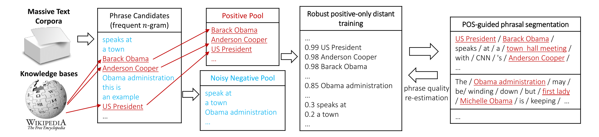

# Automated Phrase Mining from Massive Text Corpora

## 论文简介

这篇论文的目的, 是从大量的语料中, 自动地提取出高质量的phrase, 而且不需要任何人工标注. 最终得到的模型, 输入是任意的word sequence, 输出是这些sequence能够作为phrase的质量排名列表, 排名靠前的为高质量的phrase.

整体过程如下图所示:



## 什么是phrase

Phrase是在语料中连在一起出现的sequence of words, 在对应的上下文中, 是一个**完整的语义单元**(semantic unit). 一个phrase的质量应当定义为这个word sequence能够成为一个语义单元的概率. 应当满足几个标准:

- Popularity: 高质量phrase应当在给定的语料集合中出现足够多的次数
- Concordance(一致度): 若干字的组合搭配形成高质量短语, 而这种组合出现的概率, 应当远大于随机的概率
- Informativeness(信息量): 一个phrase如果代表着一个特殊的概念/主题, 说明其具有足够的信息度
- Completeness(完整度): 对于较长的高质量phrase, 它本身, 以及它的所有子序列, 都能够满足以上三条衡量标准. 在考虑上下文的情况下, 应当选取一个完整的语义单元作为phrase

## AutoPhrase

本文提出的自动提取高质量phrase的算法为**AutoPhrase**. 通过有监督训练, 得到对phrase质量能够进行评分的模型, 而训练模型需要的标签无序人工标注.

AutoPhrase的整体过程分为以下几步.

### 组建候选集

首先对语料中的所有句子, 得到所有的`n-grams`字/词序列. 这里使用的$$n$$是一个返回, 例如取出所有大于等于2, 小于等于8的序列.

然后, 为了符合流行度的要求, 使用一个阈值$$\tau$$, 根据语料的大小来设置, 例如30, 筛选出所有频数大于这个阈值的序列作为短语候选集(set of phrase candidates).

我们将得到的其中一个长度为$$n$$的字/词序列表示为$$w_1w_2\cdots w_n$$, 其中$$w_i$$是序列中第$$i$$个字/词. 定义这个短语序列的phrase quality为:

$$Q(w_1w_2\cdots w_n)=p(\lceil w_1w_2\cdots w_n \rfloor|w_1w_2\cdots w_n) \in [0,1]$$

其中, $$\lceil w_1w_2\cdots w_n \rfloor$$表示序列$$w_1w_2\cdots w_n$$真的是一个质量短语的事实.

我们把$$Q(\cdot)$$称为**phrase quality estimator**. 这个estimator就是下面我们要用数据和标签去学习的一个模型.

### 学习评分模型

评分模型是通过一系列的统计特征(statistical features)学习到的. 这些特征是用来描述序列的Concordance(一致度)和Informativeness(信息量)的. 训练完成后, 得到的模型就是上面提及的$$Q(\cdot)$$, 值域在$$[0,1]$$范围内. 如果在组建候选集时采用了`1-ngram`, 对于这些单字/词(unigrams), 我们定义他们的$$Q$$值为1.

论文的代码在[github](https://github.com/shangjingbo1226/AutoPhrase)中, 相关的特征工程代码在[feature_extraction.h](https://github.com/shangjingbo1226/AutoPhrase/blob/master/src/classification/feature_extraction.h)文件中. 开发语言为`c++`. 使用到的所有统计特征, 与作者的上一篇Phrase Mining论文[Mining Quality Phrases from Massive Text Corpora](http://hanj.cs.illinois.edu/pdf/sigmod15_jliu.pdf)是完全一致的. 主要考虑到衡量候选短语的一致性和信息度.

#### 一致性(Concordance Features)

衡量候选短语中所有`sub-units`的一致性, 需要考虑所有的划分方式, 总结出最终的评价.

**互信息**

互信息是衡量短语的一致性, 或者成为凝聚度的重要指标. 论文中所有衡量一致性的指标都与之相关. 这是因为将短语(长度大于2)划分为左右两部分有多个分割点, 最优的分割点是根据互信息确定的, 其他的统计量指标也是根据最优分割方案计算的. 互信息的详细内容参考[单词短语的统计量与评价指标](/自然语言处理/概率相关/单词短语的统计量与评价指标.md)

对于任意短语$$u \in U$$, 其频数为$$f[u]$$, 对应的概率为$$p(u)$$, 计算方法为:

$$p(u)=\frac{f[u]}{\sum_{u^{\prime} \in \mathcal{U}} f\left[u^{\prime}\right]}$$

将其分割为左右两个`sub-units` $$\left\langle u_{l}, u_{r}\right\rangle$$, 分割的依据是这种分割方式有着**最小的互信息值**, 即:

$$\left\langle u_{l}, u_{r}\right\rangle=\arg \min _{u_{l} \oplus u_{r}=v} \log \frac{p(v)}{p\left(u_{l}\right) p\left(u_{r}\right)}$$

找到最佳的分割点, 确定$$\left\langle u_{l}, u_{r}\right\rangle$$之后, 互信息(pointwise mutual information)表示为:

$$P M I\left(u_{l}, u_{r}\right)=\log \frac{p(v)}{p\left(u_{l}\right) p\left(u_{r}\right)}$$

**KL散度**

这里指的是point-wise Kullback-Leibler divergence. KL散度, 即相对熵, 是描述**两个概率分布**之间差异的一种方式, 差异越大, KL散度越大, 是一种广义的距离.

而且, 我们认为如果一个短语的一致性比较高, 这个短语的左右两部分应当是紧密联系的, 共现的概率一定要远大于随机组合而拼在一起的概率. 因此, 我们衡量这两个概率分布之间的差值, 就能评价这个候选短语的一致性.

对应的公式如下, 从公式来看, 相当于互信息又乘了一个候选短语$$v$$出现的概率, 这样减缓了互信息中对低频短语的衡量偏差.

$$P K L\left(v \|\left\langle u_{l}, u_{r}\right\rangle\right)=p(v) \log \frac{p(v)}{p\left(u_{l}\right) p\left(u_{r}\right)}$$

**互信息相关**

另外在代码中还出现了其他类似于这两个指标的统计量:

- $$\log \frac{\text{\#}(v)}{\sqrt{\text{\#}\left(u_{l}\right)} \sqrt{\text{\#}\left(u_{r}\right)}}$$, 其中$$\text{\#}(\cdot)$$表示序列的频数
- $$\sqrt{\text{\#}(v)} \cdot \text{PMI}$$
- $$\#(v) \cdot \text{PMI}$$

#### 信息度量(Informativeness Features)

衡量某个候选短语是否包含了足够的信息量可能不太好统计, 但可以通过一些规则, 提取出那些没有信息量的候选短语, 用这些规则作为特征. 论文从以下几个角度来评价.

**停用词**

如果短语的开始或者结束是停用词, 那很可能是句子的部分内容, 不能作为短语. 文中使用了两个布尔型特征:

- 短语的第一次词是否是stopword
- 短语的最后一个词是否是stopword

对于中文, 需要以分词结果作为最小单元, 而不是以字为单元来做这个任务.

**IDF**

IDF(inverse document frequency)是传统的, 用来衡量一个词能够提供多少信息量(依据语料集计算得到), 计算方法为:

$$\operatorname{IDF}(w)=\log \frac{|\mathcal{C}|}{\left|\left\{d \in[D]: w \in C_{d}\right\}\right|}$$

一般来说, 质量短语其平均IDF值不应很小. 因此我们使用以下特征:

- 短语中所有词的IDF, 进行简单平均

**标点符号**

我们使用标点符号的规则来加强短语的信息. 认为: 如果短语经常在引号, 括号中出现, 或者首字母经常大写, 这些都是质量短语的表现. 因此使用如下的三个特征:

- 短语被包含在引号中的概率
- 短语被包含在括号中的概率
- 短语首字母大写的概率, 中文肯定无用啦

之所以是概率, 是我们要遍历该短语所有的上下文, 然后统计概率. 注意这里的被包含指的是在引号或括号中只有这个短语的情况, 即搜索的时候, 只需要知道上下文各一个字符即可.

**Outside feature**

此外在论文中没有描述, 但在代码中有使用到的outside特征. 统计的是候选短语中的词在上下文中出现的情况, 这里的上下文定义为, 以短语所在句子为中心, 上下各一句. 计算步骤如下:

- 首先对候选短语内部每个词, 统计其在候选短语中出现的次数
- 对该候选短语在语料中所有出现的位置进行循环
    - 以候选短语当前所处的句子为中心, 最多向上下各遍历一个句子, 统计这三个句子中(包含这个候选短语)所有单词的在这三句话中的出现频数
    - 对于候选短语中包含的每个词, 计算上下文中与候选短语中的频率差值(应当是都不小于0的), 并计入总的差值统计
    
        ```c++
        for (size_t j = 0; j < tokens.size(); ++ j) {
            TOKEN_ID_TYPE diff = context[tokens[j]] - local[tokens[j]];
            assert(diff >= 0);
            outside[j] += diff;
        }
        ```
    
- 对于候选短语中包含的每个词, 使用差值乘以这个词对应的IDF值

    ```c++
    double sum = 0, norm = 0;
    for (size_t i = 0; i < tokens.size(); ++ i) {
        sum += outside[i] * Documents::idf[tokens[i]];
        norm += Documents::idf[tokens[i]];
    }
    ```

- 使用如下的代码得到最终的特征值

    ```c++
    double outsideFeat = sum / norm;
    ```
