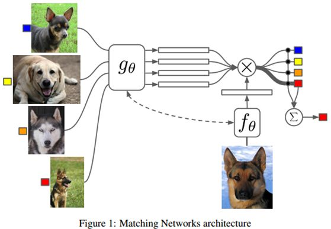

## 引入

也是一种Metric-based模型. 孪生模型(Siamese Neural Network)在训练和测试的时候使用的样本是以**对pair**的形式, 判断两张图片, 两句短文本等等是不是属于同一样本. 使用pair这种形式天生的劣势, 在训练和测试时, 如何合适的构造样本都是需要一定的策略的. 例如在训练时相同分类和不同分类的样本比例应为1:1等等.

而**Matching Network**使用了不同的逻辑, 它的训练和测试样本不再是一对对图片, 文本, 而是如同普通模型一样使用单个样本. 当然在One-shot任务中, 还是要分为support set和batch set的, 只不过set中的每个样本不再是一对图片, 而是一张图片.

Matching Network是一个端到端的模型. 它的结构设计处于以下考虑:

- 在判断新图片的分类时(上图右侧单图), 能够充分使用support set(上图左侧四图)中的信息. 具体来说是将新图的类别结果来源于support set中的样本标签. 这在Siamese Neural Network中是不存在

- 新图的标签预测类似于**Nearest Neighbors**, 比较与support set中样本的近似程度, 通过一定的策略/规则(如相似度加权)从supprot set中的标签, 得到预测标签. 这种类似于Nearest Neighbors的方法是**non-parametric**的

- 对于新的之前从未观测到的类别, 可以直接使用模型在这些类别上进行预测得到高质量的结果, 而且不用对训练好的模型做任何操作

## 模型解释

先从模型的最后部分, 如何得到预测样本的类别来看.

对于包含$$k$$个样本的support set, 将一个样本的(image, labal)对记为$$S=\left\{\left(x_{i}, y_{i}\right)\right\}_{i=1}^{k}$$. 对于新的预测样本$$\hat{x}$$, 希望得到高质量的预测$$\hat{y}$$.

训练好的模型既是一个映射函数$$c_{S}(\hat{x})$$, 可以看到样本的预测结果是和support set $$S$$紧密相关的, 因此可以将模型记为$$P(\hat{y} | \hat{x}, S)$$. 因此test样本的预测类别为:

$$\arg \max _{y} P(y | \hat{x}, S)$$

对于test样本, 使用**attention**思想去计算它的预测类别$$\hat{y}$$:

$$\hat{y}=\sum_{i=1}^{k} a\left(\hat{x}, x_{i}\right) y_{i}$$

