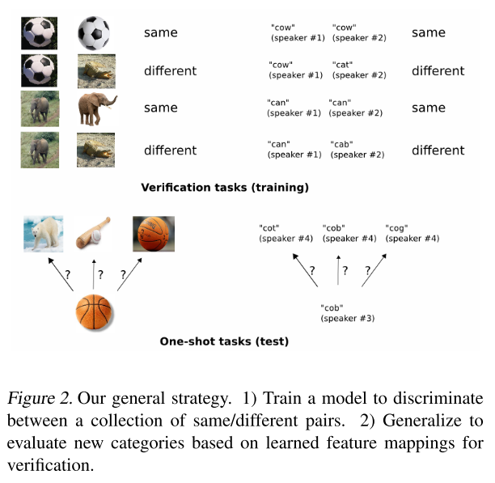
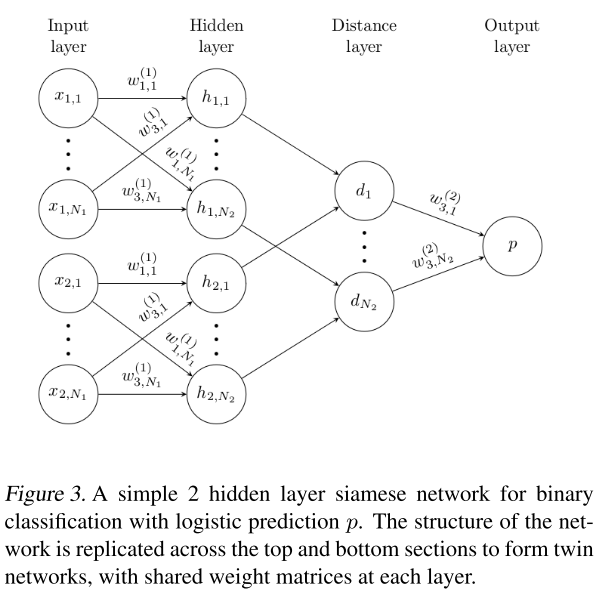
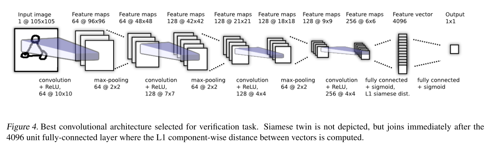

## 引入

Algorithms often break down when forced to make predictions about data for which little supervised information is available. 对于样本量很少的类别, 现有的分类算法在分类时, 表现很差, 我们希望在不需要扩充样本的情况下, 能够有效的将算法的能力在少数类中得到提升.

例如, 对于分类任务, 对于有些类别, 我们有些类别, 我们只观察到一个样本(训练集中), 然后就需要对一个测试样本预测它的类别. 我们将其称之为**one-shot learning**.

文章提出一种新的方法, 通过多层非线性的深度学习框架, 自动地获取输入的表征, 而且这种表征能力具有很好的泛化性, 能够在只有少量样本的类别中也有很好的表现. 然后再结合one-shot learning的特点, 将分类过程分为不同的特征, 总体获得即有鲁棒性, 又能够在同类识别上表现很好.

## 方法

这是一篇图像领域的文章, 样本因此都是图像. 自然语言领域可以类比.

我们通过metric-based的监督学习模型, 即siamese neural networks来学习图像(文本)的表征, 然后进行one-shot learning任务, 重复使用这个神经网络提取特征(而不需要重新训练).

上面所述的过程用图表示如下:



对于图像的表征, 采用了**large siamese convolutional neural networks**, 主要考虑到:

- 能够学习到图像的通用特征(共性特征), 从而样本数很少的类别中的样本进行预测时, 很有帮助
- 从数据源中采样得到的样本对, 用标准的优化方法就能够进行训练
- 用深度学习的方法就能够得到一个很棒的方法, 从而摆脱了对专业领域的知识的依赖

为了得到这种one-shot分类模型, 首先要获得一个神经网络模型, 能够很好地对图片对是否属于一个类别进行区分, 这就是基础的图像验证任务. 因此我们认为, 那些表现很好的用于图像验证的神经网络模型, 都能够很好的扩展到one-shot classification任务当中来.

这种verification model(图像验证模型)将两张图片是否属于同一类别用概率表示. 在训练得到这种模型后, 在做测试预测时, 对于一张新的图片, 就可以判断它是否属于一些新颖的类别了(通过组成图片对来进行), 对于这张图片组成的若干个image pair, 选取具有最高分数的pair作为最有可能的结果, 从而完成了one-shot任务.

## Siamese Networks

Siamese Networks(孪生网络)就是为了完成上述的Verification工作的. Siamese Networks是一个比较古老的模型, 在90年代就被提了出来.

Siamese Networks如同它的名字一样, 包含了一对**且共享参数**的twin networks, 分别接受不同的inputs, 并且在网络的最后使用一个**energy function**连接起来. energy function的作用是在网络的末端抽取到最终的表征后, 计算度量两边的相似性.

由于参数的共享, twin networks之间会有高度的一致性关系. 这种一致性关系表现在将两个极其相似的图片放入网络中, 两边抽取到的表征向量在向量空间中不会有很大的差异. 而且这种结构是对称的, 对于两张图片, 无论我们放入的位置如何, 末层得到的metric都会是一样的, 避免了样本的位置带来的误差.

整体的图示如下:



## 模型结构

首先是多层卷积层进行表征(对于NLP问题, 也可以更换成其他如RNN, Transformer等), 在一层全连接层之后, 再接上最顶层的energy function层评价相似性.

具体来说, siamese convolutional neural network 拥有$$L$$层卷积, 每层的卷积核的通道数量为$$N_l$$. 我们使用$$\mathbf{h}_{1,l}$$表示first twin第$$l$$层输出的隐向量, 同理用$$\mathbf{h}_{2,l}$$表示second twin第$$l$$层输出的隐向量.

每个卷积层都用**ReLU**函数进行激活. 后面的全连接成或最后的metric层用**sigmoid**进行激活.

这里的卷积层使用的卷积核比较特殊, 每层使用$$N_l$$个卷积核, 不同层的卷积核有着不同的size, 但步幅(stride)都是固定为1的. 每层卷积核的数量为16的倍数. 使用ReLU激活函数, 并且每层的最后使用一个与卷积核size一直, 步幅为2的max pool. 因此第$$l$$层的第$$k$$个卷积核的输出为:

$$
\begin{array}{l}
{a_{1, m}^{(k)}=\operatorname{max-pool}\left(\max \left(0, \mathbf{W}_{l-1, l}^{(k)} \star \mathbf{h}_{1,(l-1)}+\mathbf{b}_{l}\right), 2\right)} \\
{a_{2, m}^{(k)}=\operatorname{max-pool}\left(\max \left(0, \mathbf{W}_{l-1, l}^{(k)} \star \mathbf{h}_{2,(l-1)}+\mathbf{b}_{l}\right), 2\right)}
\end{array}
$$

其中$$\mathbf{W}_{l-1, l}^{(k)}$$是一个三维的张量. 并且对最后一个卷积层得到的结果进行flatten, 得到一个表征向量. 后面紧跟一个全连接层. 然后接着计算twin之间距离的一层, 最后给出一个标量, 作为距离的度量.

具体来说, 最后两层(全连接层, metric计算层)进行了如下的映射, 得到了计算距离的**prediction vector**:

$$\mathbf{p}=\sigma\left(\sum_{j} \alpha_{j}\left|\mathbf{h}_{1, L-1}^{(j)}-\mathbf{h}_{2, L-1}^{(j)}\right|\right)$$

twin network将两张图片映射成$$\mathbf{h}_{1,L-1}$$和$$\mathbf{h}_{2,L-1}$$, 上面所说的全连接层不是对twin中单独的一个进行, 而是先对两个图片的表征向量中的每个元素对应计算L1距离得到新的距离向量后, 再进行全连接, 使用sigmoid激活, 这里的$$\alpha_j$$指的就是这层全连接层中的可训练参数. 而其中的$$j$$表示了全连接层中的第$$j$$个神经元. 这层全连接层的输入和输出的大小是等同的.

最后一层就是将$$L-1$$层得到两张图片的相似性度量, 值域在$$[0,1]$$之间.

整体的结构如下, 这里只描述了twin network其中的一个, 因为他们是共享参数的:



## 训练过程

### 损失函数

假设batch size为$$M$$, 并用$$i$$表示第$$i$$个batch. 因此$$\mathbf{y}\left(x_{1}^{(i)}, x_{2}^{(i)}\right)$$就应该是一个长度为$$M$$的向量, 代表了真值标签, 里面的值为1或者为0, 1表示两个图片是同一个类别, 0表示不是. 由于是一个二分类问题, 使用带正则项的cross-entropy目标函数表示如下:

$$\begin{array}{c}{\mathcal{L}\left(x_{1}^{(i)}, x_{2}^{(i)}\right)=\mathbf{y}\left(x_{1}^{(i)}, x_{2}^{(i)}\right) \log \mathbf{p}\left(x_{1}^{(i)}, x_{2}^{(i)}\right)+} \\ {\left(1-\mathbf{y}\left(x_{1}^{(i)}, x_{2}^{(i)}\right)\right) \log \left(1-\mathbf{p}\left(x_{1}^{(i)}, x_{2}^{(i)}\right)\right)+\boldsymbol{\lambda}^{T}|\mathbf{w}|^{2}}\end{array}$$

### 优化

由于twin network共享参数, 因此目标函数在反向传播时, 在两个网络都会得到对应参数的梯度, 因此参数在更新时时将这两个梯度加在一起然后再更新的.

### 参数初始化

作者使用如下方法初始化参数

- 卷积层参数使用均值为0, 标准差为$$10^{-2}$$的正态分布初始化
- 卷积层的bias使用均值为0.5, 标准差为$$10^{-2}$$的正态分布初始化
- 全连接层的参数使用均值为0, 标准差为0.2的正态分布初始化
- 全连接层的bias使用均值为0.5, 标准差为$$10^{-2}$$的正态分布初始化, 与卷积层一样

### 学习率变化策略

每一个epoch缩小1%, 即$$\eta_{j}^{(T)}=0.99 \eta_{j}^{(T-1)}$$.

### 训练试验

使用了Omniglot data set. 这是一个包含各国以及各时代alphabets的字符集数据集, 共有50个不同的字符集, 每个字符集包含的字符个数在15个到40个之间. 每个字符又包含20个图像样本. 再将40个字符集作为background set, 用来训练和dev调试参数, 剩余的10个字符集作为evaluation set, 用来做test, 评价进行one-shot分类任务的表现如何.

使用60%的数据做训练, 即30个字符集, 每个字符抽取20*0.6=12个图像样本. 由于有的字符集包含的字符较多, 有的较少, 又使用方法保证每个字符集在训练过程中使用使用到的图片的数量是相同的, 但不保证每个字符集中的所有字符使用的样本数量是相同的. 又使用了多种数据扩充的方法, 大大扩充了训练集中样本的数量(原来的9倍).

注意这里的样本是一个**image pair**而不是单张的图片. 组成图片对的逻辑, 是随机对样本进行所有的相同/不同对进行采样得到(这样会不会有数据不平衡的问题?).

而用来进行validation的dev集, 有10个不同字符集, 并且每个有4张图片. 用同样本的方法抽样组成dev图片对样本进行验证.

### Test

训练完毕之后, 对于一个新的图片(图片来自于测试集), 选取若干个类别(类别也来自于测试集独有的), 从这些类别中获取一个样本, 组成样本对, 以最高的概率对应的类别为结果.

训练的细节可以参考: [【One Shot】《Siamese Neural Networks for One-shot Image Recognition》](https://blog.csdn.net/bryant_meng/article/details/80087079).

## 代码

关于这篇论文, 有一篇文章及代码重现了论文中的过程(细节部分不太一致, 例如数据增强, 超参数优化, 迭代次数等等, 但整体的过程很清晰), 参考:

> [One Shot Learning and Siamese Networks in Keras](https://sorenbouma.github.io/blog/oneshot/)

对应的jupyter notebook代码为:

> [SiameseNet.ipynb](https://github.com/sorenbouma/keras-oneshot/blob/master/SiameseNet.ipynb)

翻译文章:

> [【深度神经网络 One-shot Learning】孪生网络少样本精准分类](https://yq.aliyun.com/articles/209297)

文章使用keras对论文中的模型进行了重建, 可以更好的理解两张图片的交互部分.

```python
from keras.layers import Input, Conv2D, Lambda, merge, Dense, Flatten,MaxPooling2D
from keras.models import Model, Sequential
from keras.regularizers import l2
from keras import backend as K
from keras.optimizers import SGD,Adam
from keras.losses 
import binary_crossentropy
import numpy.random as rng
import numpy as np
import os
import dill as pickle
import matplotlib.pyplot as plt
from sklearn.utils import shuffle

def W_init(shape,name=None):
    """Initialize weights as in paper"""
    values = rng.normal(loc=0,scale=1e-2,size=shape)
    return K.variable(values,name=name)#//TODO: figure out how to initialize layer biases in keras.

def b_init(shape,name=None):
    """Initialize bias as in paper"""
    values=rng.normal(loc=0.5,scale=1e-2,size=shape)
    return K.variable(values,name=name)

input_shape = (105, 105, 1)
left_input = Input(input_shape)
right_input = Input(input_shape)
#build convnet to use in each siamese 'leg'
convnet = Sequential()
convnet.add(Conv2D(64,(10,10),activation='relu',input_shape=input_shape,
                   kernel_initializer=W_init,kernel_regularizer=l2(2e-4)))
convnet.add(MaxPooling2D())
convnet.add(Conv2D(128,(7,7),activation='relu',
                   kernel_regularizer=l2(2e-4),kernel_initializer=W_init,bias_initializer=b_init))
convnet.add(MaxPooling2D())
convnet.add(Conv2D(128,(4,4),activation='relu',kernel_initializer=W_init,kernel_regularizer=l2(2e-4),bias_initializer=b_init))
convnet.add(MaxPooling2D())
convnet.add(Conv2D(256,(4,4),activation='relu',kernel_initializer=W_init,kernel_regularizer=l2(2e-4),bias_initializer=b_init))
convnet.add(Flatten())
convnet.add(Dense(4096,activation="sigmoid",kernel_regularizer=l2(1e-3),kernel_initializer=W_init,bias_initializer=b_init))
#encode each of the two inputs into a vector with the convnet
encoded_l = convnet(left_input)
encoded_r = convnet(right_input)
#merge two encoded inputs with the l1 distance between them
L1_distance = lambda x: K.abs(x[0]-x[1])
both = merge([encoded_l,encoded_r], mode = L1_distance, output_shape=lambda x: x[0])
prediction = Dense(1,activation='sigmoid',bias_initializer=b_init)(both)
siamese_net = Model(input=[left_input,right_input],output=prediction)

optimizer = Adam(0.00006)
# TODO: get layerwise learning rates and momentum annealing scheme described in paperworking

siamese_net.compile(loss="binary_crossentropy",optimizer=optimizer)


siamese_net.count_params()
```

可以看到, 在对单个图片进行表征的时, 在卷积展平之后, 还使用了一层`Dense`层, 并进行sigmoid, 得到了每张图片长度为4096的表征向量:

```python
convnet.add(Dense(4096,activation="sigmoid",kernel_regularizer=l2(1e-3),kernel_initializer=W_init,bias_initializer=b_init))
```

之后对两张图片计算绝对距离, 得到距离向量, 然后再连接一层激活函数为sigmoid的输出全连接层, 得到两张图片属于同一类别的概率:

```python
L1_distance = lambda x: K.abs(x[0]-x[1])
both = merge([encoded_l,encoded_r], mode = L1_distance, output_shape=lambda x: x[0])
prediction = Dense(1,activation='sigmoid',bias_initializer=b_init)(both)
```

以上是模型部分. Siamese模型的特殊的训练和测试方法更需要注意. 由于使用的是图片对作为输入, 因此进入模型训练的样本数量是图片样本的数量的平方正比, 所以即使原有的样本数量很少, 也不必担心样本量不足无法对模型中这么多参数拟合的问题.

需要关注的点有:

- 投入到模型训练的每个batch中的样本类别应当是1:1的, 即有的一半样本图片对是属于一个类别的, 另外一半是不属于同一个类别的
    - 因此需要在生成batch的时候使用一定的策略
- 这里的batch和普通模型使用的batch在模型中的地位一样, 但这里的batch中包含的样本的数量, 与类别的数量有关, 而不是普通的样本数量选择
- 这里的train, dev, test集合会在类别上进行分割, 例如在dev中的任何类别, 在train中都没有出现过

生成训练集和dev集的代码如下:

```python
class Siamese_Loader:
    """For loading batches and testing tasks to a siamese net"""
    def __init__(self,Xtrain,Xval):
        self.Xval = Xval
        self.Xtrain = Xtrain
        self.n_classes,self.n_examples,self.w,self.h = Xtrain.shape
        self.n_val,self.n_ex_val,_,_ = Xval.shape
    def get_batch(self,n):
        """Create batch of n pairs, half same class, half different class"""
        categories = rng.choice(self.n_classes,size=(n,),replace=False)
        pairs=[np.zeros((n, self.h, self.w,1)) for i in range(2)]
        targets=np.zeros((n,))
        targets[n//2:] = 1
        for i in range(n):
            category = categories[i]
            idx_1 = rng.randint(0,self.n_examples)
            pairs[0][i,:,:,:] = self.Xtrain[category,idx_1].reshape(self.w,self.h,1)
            idx_2 = rng.randint(0,self.n_examples)
            #pick images of same class for 1st half, different for 2nd
            category_2 = category if i >= n//2 else (category + rng.randint(1,self.n_classes)) % self.n_classes
            pairs[1][i,:,:,:] = self.Xtrain[category_2,idx_2].reshape(self.w,self.h,1)
        return pairs, targets
    def make_oneshot_task(self,N):
        """Create pairs of test image, support set for testing N way one-shot learning. """
        categories = rng.choice(self.n_val,size=(N,),replace=False)
        indices = rng.randint(0,self.n_ex_val,size=(N,))
        true_category = categories[0]
        ex1, ex2 = rng.choice(self.n_examples,replace=False,size=(2,))
        test_image = np.asarray([self.Xval[true_category,ex1,:,:]]*N).reshape(N,self.w,self.h,1)
        support_set = self.Xval[categories,indices,:,:]
        support_set[0,:,:] = self.Xval[true_category,ex2]
        support_set = support_set.reshape(N,self.w,self.h,1)
        pairs = [test_image,support_set]
        targets = np.zeros((N,))
        targets[0] = 1
        return pairs, targets
    def test_oneshot(self,model,N,k,verbose=0):
        """Test average N way oneshot learning accuracy of a siamese neural net over k one-shot tasks"""
        pass
        n_correct = 0
        if verbose:
            print("Evaluating model on {} unique {} way one-shot learning tasks ...".format(k,N))
        for i in range(k):
            inputs, targets = self.make_oneshot_task(N)
            probs = model.predict(inputs)
            if np.argmax(probs) == 0:
                n_correct+=1
        percent_correct = (100.0*n_correct / k)
        if verbose:
            print("Got an average of {}% {} way one-shot learning accuracy".format(percent_correct,N))
        return percent_correct
```
