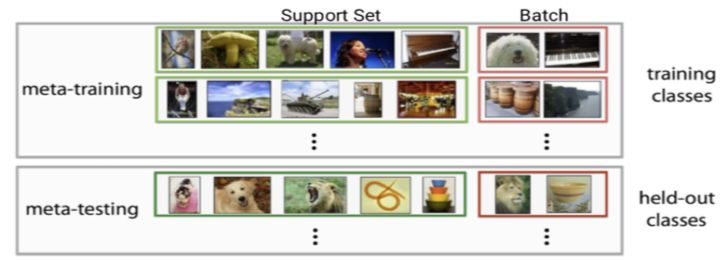

## 小样本学习概述

小样本学习, 即**Few-shot learning**, 在CV和NLP的分类问题中非常常见. 现实中的多种任务都可以抽象成多分类问题, 如果整体样本量很少, 或者对于一些类别(这种类别的数量在整体中可能还比较多)其中的样本量很少, 如果还使用常规的softmax和cross entropy这种形式进行训练, 肯定会出现过拟合问题, 从而无法有效的进行学习, 解决问题.

这种小样本问题在各个领域, 各种形式的数据上都会遇到, 但是CV和NLP又有其特殊的地方. 图像和自然语言, 都是符合一定的规律的, 不因这一类样本的多少而有区别. 例如对于自然语言, 对于任何分类问题中的任何一个语言样本, 肯定都是符合同样的句法, 语法, 表达释义规律等等. 而且用来解决NLP任务的网络: RNN, CNN, Transform等, 我们称之为**特征抽取器**. 因此在解决小样本问题时, 可以使用一定的网络结构抽取文本的特征, 然后在进行后续的处理. 这样小样本也就能与其他的大量样本公用这些特征抽取网络的参数, 换句话说就能共享其他样本的信息了, 后面需要做的就是一个分类问题的设计了.

这部分的研究分支称为Few-shot Learning, 往往首先在图像领域取得进展. 由于NLP领域和图像领域的相似性, 往往可以直接或经过优化后应用在NLP领域. 这里介绍的方法相关的论文都是图像领域的论文, 领会意图和方法, 根据实际情况转接即可.

## Meta Learning 元学习

此类模型的灵感来源于人类在现实生活中如何处理小样本问题的. 这是因为人类特别擅长根据极少量的样本认识并识别一个新物体. 关键点是, 人类对于图像或者文字已经有了非常扎实的能力累计, 当一个新样本出现时, 人类的**视觉系统**或者**思考系统**天生的就能够对任意物体(样本)提取特征, 然后与其他已知的进行比较, 从而产生学习和判断.

因此小样本学习的过程被分解成了两部分: **提取特征**和**比较能力**. 提取特征的能力前面已经说过了, 现在的神经网络大部分都是在做提取特征的工作, 网络越深, 提取的特征越深. 而比较能力就需要特别的设计了.

这种学习的形式就非常符合**Meta Learning**(元学习)了, 可以看做是元学习在监督学习领域的应用. 元学习**目标**就是通过学习大量的**任务**, 从而学习到**内在的元知识**, 通过训练过程中创建的**很多任务**来学习识别物体的能力, 从而在面对新的少样本学习任务时, 能够**充分利用已经学习到的识别能力**(元知识), 实现快速对新物体的识别.

Meta Learning又称为Learning to Learn. 在**meta learning**阶段, 将数据集分解为不同的meta task(任务), 去学习类别变化情况下模型的泛化能力, 在**meta testing**阶段, 面对全新的类别, 不需要变动已有的模型, 就可以完成分类.

具体来说, few-shot learning的**训练集**中包含了很多类别, 每个类别中有多个样本. 在训练阶段, 会在训练集中随机抽取C个类别, 每个类别k个样本, 总共Ck个样本, 构建一个**meta task**, 作为模型的**支撑集 support set**输入, 再从这C个类中剩余的数据中抽取一批(batch)样本, 这里的抽取就不再平分到每个类别中了, 将这一批样本作为模型的**预测对象 batch set**. 因此这个task就是要求模型从$$Ck$$个数据中, 学会如何分类这$$C$$个类别, 并将这个任务的整个过程称为一次**训练 episode**.

这样的任务也被称为**C-way k-shot问题**. 如下图称为2-way 5-shot.

每次训练(episode)都会采样得到不同的**meta task**. 整体来看, 训练过程包含了不同的类别组合, 这种机制使得模型学会不同的task中的共性部分(如提取特征的方法等). 通过这种学习机制学到的模型, 在面对新的未见过的meta task时, 也就能够较好的进行分类了.

## Few-shot learning 的分类

Few-shot learning模型大致可以分为三类:

- model based
- metric based
- optimization based

将会对三类中的经典方法及其相关论文进行介绍. 这里简单的对三类模型进行抽象介绍, 并引出相关的经典论文.

#### Model Based

- One-shot learning with memory-augmented neural networks

#### Metric Based

如果在 Few-shot Learning 的任务中去训练普通的基于 cross-entropy 的神经网络分类器, 那么几乎肯定是会过拟合. 相反, 很多非参数化的方法(最近邻, Kmeans等)是不需要优化参数的, 因此可以在 meta-learning 的框架下构造一种可以端到端训练的 few-shot 分类器. 该方法是对样本间距离分布进行建模, 使得同类样本靠近, 异类样本远离.

- Siamese neural networks for one-shot image recognition(Siamese Network, 孪生网络)
- Matching networks for one shot learning
- Prototypical networks for few-shot learning
- Learning to compare: Relation network for few-shot learning

#### Optimization Based

- Optimization as a model for few-shot learning
- Model-agnostic meta-learning for fast adaptation of deep networks

#### NLP中的Few-shot learning

文本与图像的一大区别在于其多样性和噪音更大, 因此有相关的论文是专门针对文本的小样本学习.

- Hybrid Attention-Based Prototypical Networks for Noisy Few-Shot Relation Classification
- Diverse few-shot text classification with multiple metrics
