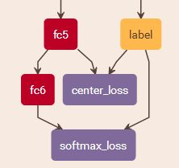

## 引入

**Center loss**与triplet loss本质上都是一种**度量学习**. 与triplet loss需要构造正样本和负样本不同, center loss只需要在原来的softmax分类模型基础上, 在特征提取完毕后引入关于center loss的计算即可, 如下图:



然后两部分按比例加在一起, 组成最终的损失进行训练. 这里的比例是一个超参数.

对于多分类问题, 一般使用softmax+交叉熵. 经过整个神经网络, 抽取得到样本的特征$$\mathbf{x}$$, 有些情况下, 我们会更关心特征向量$$\mathbf{x}$$而非最后的分类结果.

例如人脸识别, 假设我们的训练集中有10万张人脸, 那么这是一个10万分类的模型. 训练完毕后到了具体的应用, 可能只有几百人, 或是几百万人, 其中的一些人还不在训练集中, 这种情况下原本的分类就没了意义.

这种情况下, 我们对特征提取提出了新的要求, 即训练后的模型, 对于同一类的样本, 得到的特征向量$$\mathbf{x}$$基本相同. 那么在实际使用中, 我们只使用网络进行特征提取, 然后把提取出来的特征再使用其他的方法, 如KNN进行分别.

即我们需要的是特征具有**聚类特性**.

## 原理

以上面的意图为目的, 再使用softmax和交叉熵, 训练出来的模型就达不到要求了. 因为softmax会使特征进行分布满整个空间, 详情参考[【Technical Review】ECCV16 Center Loss及其在人脸识别中的应用](https://zhuanlan.zhihu.com/p/23340343). 为了让模型得到的特征具有聚类特性, 使用centor loss:

$$loss = - \log\frac{e^{\boldsymbol{W}_y^{\top}\boldsymbol{x}+b_y}}{\sum\limits_i e^{\boldsymbol{W}_i^{\top}\boldsymbol{x}+b_i}} + \lambda \Big\Vert \boldsymbol{x}-\boldsymbol{c}_y \Big\Vert^2$$

上式右边第一项就是softmax交叉熵损失, 后面的一项, 是增加的**聚类惩罚项**. 对于每类$$y$$, 都对应着一个可训练的中心$$\boldsymbol{c}_y$$, 即要求每个样本提取到的特征要跟自己类对应的中心靠的很近. 总的来说, 第一项负责拉开不同类之间的距离, 第二项负责缩小同一类之间的距离.

个人感觉, 这个损失函数适用于以下的样本分布情况:

- 同类样本之间的差别不能太大, 这也许是在人脸中表现好的原因
- 不同类样本之间要有一定的差别, 分类问题的根本, 而对于聚类, 可能两个类对应的中心向量很接近, 两个类就混淆在一起了

## 代码

在训练时, 每个样本对应一个类, 也对应着这个类的中心向量. 使用Embedding方法进行管理. 在测试阶段就不用再使用中心变量了, 还是使用原来的模型进行特征提取即可.

注意这里的损失是交叉熵和center loss按照5:1的比例得到的, 注意代码中对应的写法.

```python
from keras.layers import Input,Conv2D, MaxPooling2D,Flatten,Dense,Embedding,Lambda
from keras.models import Model
from keras import backend as K

nb_classes = 100
feature_size = 32

input_image = Input(shape=(224,224,3))
cnn = Conv2D(10, (2,2))(input_image)
cnn = MaxPooling2D((2,2))(cnn)
cnn = Flatten()(cnn)
feature = Dense(feature_size, activation='relu')(cnn)
predict = Dense(nb_classes, activation='softmax', name='softmax')(feature) #至此，得到一个常规的softmax分类模型

input_target = Input(shape=(1,))
centers = Embedding(nb_classes, feature_size)(input_target) #Embedding层用来存放中心
l2_loss = Lambda(lambda x: K.sum(K.square(x[0]-x[1][:,0]), 1, keepdims=True), name='l2_loss')([feature,centers])

model_train = Model(inputs=[input_image,input_target], outputs=[predict,l2_loss])
model_train.compile(optimizer='adam', loss=['sparse_categorical_crossentropy',lambda y_true,y_pred: y_pred], loss_weights=[1.,0.2], metrics={'softmax':'accuracy'})

model_predict = Model(inputs=input_image, outputs=predict)
model_predict.compile(optimizer='adam', loss='sparse_categorical_crossentropy', metrics=['accuracy'])

model_train.fit([train_images,train_targets], [train_targets,random_y], epochs=10)
#TIPS：这里用的是sparse交叉熵，这样我们直接输入整数的类别编号作为目标，而不用转成one hot形式。所以Embedding层的输入，跟softmax的目标，都是train_targets，都是类别编号，而random_y是任意形状为(len(train_images),1)的矩阵。
```

## 参考资料

- [Keras中自定义复杂的loss函数](https://kexue.fm/archives/4493#Embedding%E5%B1%82%E7%9A%84%E5%A6%99%E7%94%A8)
- [如何评价ECCV2016中提出的center loss？](https://www.zhihu.com/question/51896282)
