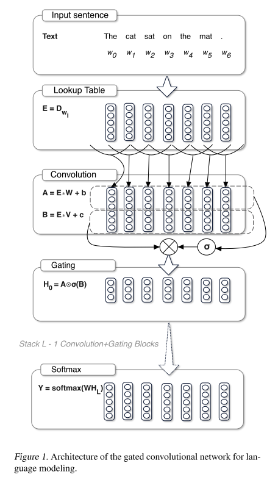

## 引入

本论文将在图像领域常常使用的**门控**(gate)结构, 引入到NLP任务当中. 当时的NLP任务多使用更符合语句形式的RNN网络, 但论文名为**Language Modeling with Gated Convolutional Networks**, 因此是**将Gate与CNN网络结合起来**, 这样做出于两种原因:

- CNN相比于RNN网络计算少, 且可以并行, 十分高效
- 但RNN的序列结构能够天然地提取句子中的长短信息(LSTM), CNN只能提取窗口覆盖范围内的信息, 为了能够提取更长的甚至整个句子(文章)的信息, 使用的方法不是扩大卷积核长度, 而是增加网络的深度, 使用多层CNN堆叠
- 但多层CNN的**梯度消失**线性十分严重, 很难堆叠起深层的CNN
- 门控(gate)的出现就是为了解决**梯度消失**的问题

当然也可以把门控结构与RNN结合, 提升RNN的深度(层数深度, 非序列深度), 从而也能搭建出较深的RNN模型.

门控结构解决问题的原理为: **providing a linear path for the gradients while retaining non-linear capabilities**. 即类似于**skip connection**结构, 但这里的选择是门控, 是一种**软**的方式.

## 结构

上图就是**Gated Convolutional Networks**的基本结构. 可以看到在`Convolution`这一层比较特出, 这里不是简单的做一次卷积, 而是使用两组不同的卷积核(卷积核大小相同, 参数不共享)做了两次卷积, 其中一组卷积结果直接线性输出, 另一组使用`sigmoid`函数处理成0到1之间的值, 最后将两组值按元素相乘.

这就是门控的操作内容, 用公式表示为:

$$h_{l}(\mathbf{X})=(\mathbf{X} * \mathbf{W}+\mathbf{b}) \otimes \sigma(\mathbf{X} * \mathbf{V}+\mathbf{c})$$

上式等号右侧, 第一项就是卷积的结果, 即一般CNN网络中卷积层的输出. 这里多了一个第二项, 即gate, 通过sigmoid函数, 输出为0到1, 可以理解为接受第一项输出的概率, 而且是输出中每个元素的接受概率是独立控制的. 这种好门结构称之为**Gated Linear Units (GLU)**.

此外还有一种称之为**Gated Tanh Units (GTU)**的门结构为:

$$\tanh (\mathbf{X} * \mathbf{W}+\mathbf{b}) \otimes \sigma(\mathbf{X} * \mathbf{V}+\mathbf{c})$$

与GLU的结构就在于输出的激活函数是什么. GTU与GLU相比, 由于其反向传播的梯度为:

$$\begin{aligned} \nabla[\tanh (\mathbf{X}) \otimes \sigma(\mathbf{X})] &=\tanh ^{\prime}(\mathbf{X}) \nabla \mathbf{X} \otimes \sigma(\mathbf{X}) \\ &+\sigma^{\prime}(\mathbf{X}) \nabla \mathbf{X} \otimes \tanh (\mathbf{X}) \end{aligned}$$

即梯度中有两项**衰减因子**$$\tanh ^{\prime}(\mathbf{X})$$和$$\sigma^{\prime}(\mathbf{X})$$, 而GLU的梯度为:

$$\nabla[\mathbf{X} \otimes \sigma(\mathbf{X})]=\nabla \mathbf{X} \otimes \sigma(\mathbf{X})+\mathbf{X} \otimes \sigma^{\prime}(\mathbf{X}) \nabla \mathbf{X}$$

比较来说, GLU的梯度中有一项$$\mathbf{X} \otimes \sigma(\mathbf{X})$$没有衰减因子, 相当于是一个**multiplicative skip connection**(倍数缩放的skip connection结构), 帮助梯度在层之间flow, 从而避免梯度消失.

## 参考

- [Language Modeling with Gated Convolutional Networks](http://arxiv.org/abs/1612.08083)
