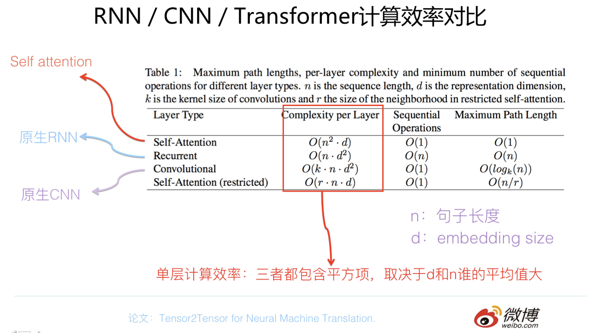

## NLP特征抽取器

CNN, RNN, Transformer是现有的三大特征抽取器. 各自有各自的特点, 优点和缺点. 逐渐的也有了优劣之分. 但是NLP任务的特点, 以及不同类型的NLP任务的特点, 使得不同类型的特征抽取器适合不同的场景. 充分理解特定NLP任务的痛点以及各种特征抽取器的优缺点, 是高效解决NLP问题的关键.

NLP的输入往往是**一句话**或者**一篇文章**, 因此体现出了输入的两个特点:

- 输入是不定长的, 短句和很长的文本, 在同样的特征抽取器上的表现, 有很大的不同
- 输入是不定长的, 只有RNN模型能够自然地处理这种不定长任务, 其他的都要靠padding或者truncate

**特征抽取器的表现主要受以下几点的影响:**

- 输入样本的长度, 短句和很长的文本, 在同样的特征抽取器上的表现, 有很大的不同
- 单词或者子句的相对位置关系很重要, 两个单词位置互换可能导致完全不同的意思
- 句子中的**长距离特征**对于理解**语义**也非常关键

## NLP任务

NLP是个很宽泛的领域, 包含了几十个子领域, 但可以归结为以下几大类任务, 此部分参考了**BERT**论文中对NLP任务的分类.

**序列标注**

句子中每个单词要求模型根据上下文都要给出一个分类类别, 常见的任务有:

- 中文分词, Tokenize
- 词性标注, POS
- 命名实体识别, NER
- [语义角色标注](http://wiki.jikexueyuan.com/project/deep-learning/wordSence-identify.html)

**分类任务**

对句子或文章给出一个分类类别, 常见的任务有:

- 文本分类
- 情感分类

**句子关系判断**

给定两个句子, 模型判断出两个句子是否具备某种**语义关系**, 常见的任务有:

- [自然语言推理](https://zhuanlan.zhihu.com/p/38738004), NLI(Natural Language Inference)
- QA
- 语义改写

**生成式任务**

输入文本内容后, 需要自主生成另外一段文字, 常见的任务有:

- 机器翻译
- 文本摘要
- 写诗造句
- 看图说话

---

从模型角度来讲, 解决这些问题的关键是**特征抽取能力**. 当然除了使用特征抽取能力强的模型, 还要解决调参的问题.

## 三大特征抽取器的特点

### RNN

#### RNN特点

**RNN的结构天然适配解决NLP的问题**, RNN的核心是每个输入对应隐层节点, 而隐层节点之间形成了线性序列, 信息由前向后在隐层之间逐步向后传递.

原始的RNN采取线性序列结构不断从前往后收集输入信息, 但这种线性序列结构在**反向传播**的时候存在**优化困难**问题, 因为反向传播路径太长, 容易导致严重的梯度消失或梯度爆炸问题.

为了解决这个问题, 后来引入了LSTM和GRU模型, 通过增加中间状态信息直接向后传播, 以此缓解梯度消失问题, 获得了很好的效果.

关于RNN会产生梯度消失或梯度爆炸的原因参考: [RNN梯度消失和爆炸的原因](https://zhuanlan.zhihu.com/p/28687529), 而LSTM为何能解决梯度消失的问题参考: [Why LSTMs Stop Your Gradients From Vanishing: A View from the Backwards Pass](https://weberna.github.io/blog/2017/11/15/LSTM-Vanishing-Gradients.html#fn:3).

RNN再融合**skip connection**(Resnet思路), **attention**机制, 并**叠加网络**把层深作深, 以及引入Encoder-Decoder框架, 极大拓展了RNN的能力以及应用效果.

RNN的结构天然适配解决NLP的问题, NLP的输入往往是个不定长的线性序列句子, 而RNN本身结构就是个可以接纳不定长输入的由前向后进行信息线性传导的网络结构, 而在LSTM引入三个门后, 对于捕获**长距离特征**也是非常有效的, 所以RNN特别适合NLP这种线形序列应用场景.

#### RNN的问题

- 随着特殊改造的CNN模型以及Transformer的模型的出现, RNN的特征抽取能力被证明偏弱
- RNN本身的序列依赖结构对于大规模并行计算来说相当之不友好, 而CNN和Transformer就不存在这种序列依赖问题

### CNN

CNN捕获特征, 关键在于卷积核覆盖的那个滑动窗口, 其实捕获到的是单词的**k-gram**片段信息, k的大小决定了能捕获多远距离的特征.

如果捕捉特征的卷积层只有一层, 来的问题是: **对于远距离特征, 单层CNN是无法捕获到的**. 如果滑动窗口k最大为2, 而如果有个远距离特征距离是5, 那么无论上多少个卷积核, 都无法覆盖到长度为5的距离的输入, **所以它是无法捕获长距离特征的.

为了能捕获到长距离的特征, 有两种典型的改进方法:

- 扩大卷积核的窗口, 这里还有两种扩大方法
  - 简单的使用更大窗口的卷积核, 例如由$$k=3$$扩大到$$k=5$$
  - 使用**Dilated卷积核**, 即卷积核覆盖的区域不在连续, 而是跳跃采集三个点, 每个点之间空一个点, 从而达到覆盖5长度的效果

- 加深CNN网络的深度
  - 两层大小为3的卷积核, 覆盖的原始输入距离就达到了5. 如果继续往上叠加卷积层, 可以继续增大卷积核覆盖输入的长度.
  - 但一般做NLP的CNN网络, 做到2到3层卷积层就做不上去了, 网络更深对任务效果没什么帮助.
  - 把Skip Connection及各种Norm等参数优化技术引入, 才能慢慢把CNN的网络深度做起来

**CNN是否能够保留原始输入的相对位置信息呢**? 对于NLP问题来说, 位置信息是很有用的.

CNN的卷积核是能保留特征之间的相对位置的, 原因为: 滑动窗口从左到右滑动, 捕获到的特征也是如此顺序排列, 所以它在结构上已经记录了相对位置信息了.

但是如果卷积层后面立即接上Pooling层的话, 例如Max Pooling, 从一个卷积核获得的特征向量里只选中并保留最强的那一个特征, 所以到了Pooling层, 位置信息就被扔掉了, 这在NLP里其实**是有信息损失**的. 更常见的做法是在输入部分, **给每个单词增加一个position embedding**, 将单词的position embedding和word embedding叠加起来形成单词输入, 这样就不用担心Pooling层丢弃位置信息的问题了.

目前CNN的一个发展趋势是抛弃Pooling层, 靠全卷积层来叠加网络深度. NLP主流的CNN的主题结构, 通常由**1-D卷积层来叠加深度**, 使用**Skip Connection来辅助优化**, 再结合**GLU门控非线性函数**, 可以将网络做到比较深.

CNN最强的还是在于其并行计算的能力, 对于单个卷积核, 每个滑动窗口位置之间没有依赖关系, 完全可以并行计算; 不同的卷积核之间也没有相互影响, 所以也可以并行计算.

### Transformer

Transformer是由多个相同的Transformer Block堆叠成的, 而Transformer Block中使用了**Multi-head self attention**, **kip connection**, **LayerNorm**, **Feed forward**等结构共同发挥作用.

对于Transformer来说, 本身是**不能保留位置相对信息的**, 为了能够保留输入句子单词之间的相对位置信息, **必须明确的在输入端将Position信息编码**:

- Transformer是用位置函数来进行位置编码的
- Bert等模型则给每个单词一个Position embedding, 将单词embedding和单词对应的position embedding加起来形成单词的输入embedding

关于NLP句子中**长距离依赖特征**的问题, Self attention天然就能解决这个问题, 因为在集成信息的时候, 当前单词和句子中任意单词都发生了联系.

Transformer有两个版本, Transformer base和Transformer big, 两者结构其实是一样的, 主要区别是包含的Transformer Block数量不同, 分别包含12个和24个Block.

## 三种特征抽取器的比较

主要是通过以下几种能力的对比, 得出优劣:

- 语义特征提取能力
- 长距离特征捕获能力
- 任务综合特征抽取能力
- 运算效率

### 语义特征提取能力

- Transformer在这方面的能力非常显著地超过RNN和CNN
- RNN和CNN两者能力差不太多

### 长距离特征捕获能力

- 原生CNN特征抽取器在这方面极为显著地弱于RNN和Transformer
- Transformer微弱优于RNN模型, 但在比较远的距离上(在主语-谓语一致性检测任务中, 主语谓语距离大于13时), RNN微弱优于Transformer. 综合来看, 可以认为Transformer和RNN在这方面能力差不太多, 而CNN则显著弱于前两者

另外, 对于Transformer来说, Multi-head attention的**head数量严重影响NLP任务中Long-range特征捕获能力**, head越多越有利于捕获long-range特征.

### 任务综合特征抽取能力

以机器翻译为例, 作为NLP任务中最具挑战和代表性的任务, 这是因为它基本上是对NLP各项处理能力综合要求最高的任务之一, 综合考虑了对于两种语言的:

- 词法
- 句法
- 语义
- 上下文处理能力
- 长距离特征捕获

结论如下:

- Transformer综合能力要明显强于RNN和CNN
- RNN和CNN看上去表现基本相当, CNN略好一些(From GPT论文)

### 运算效率

并行计算能力比较直观, Transformer和CNN差不多, 都远远强于RNN.

单纯比较三个模型的计算效率, 如下图所示:

其中需要说明的是, Self attention只是Transformer Block中的一部分, 不是整个Transformer Block的计算量. Transformer包含多层, 其中的skip connection后的Add操作及LayerNorm操作不太耗费计算量, Feed forward相对比较耗时, 复杂度是$$O(nd^2)$$. 所以如果把Transformer Block多层当作一个整体和RNN及CNN单层对比的话, Transformer Block计算量肯定是要多于RNN和CNN的, 因为它本身也包含一个n乘以d的平方.

从图中可以看出三者的主要区别是:

- Self attention的平方项是句子长度, 因为每一个单词都需要和任意一个单词发生关系来计算attention
- RNN和CNN的平方项则是embedding size

因此比较复杂度要根据具体的情况来比较:

- CNN计算量是大于RNN的
- 如果句子平均长度n大于embedding size, 那么意味着Self attention的计算量要大于RNN和CNN, 反过来RNN和CNN的计算量要大于self attention. 所以在大多数任务里面其实self attention计算效率是要高于RNN和CNN的

考虑的是三者单层的计算量, 结论是**Transformer Block > CNN > RNN**. 但现在无论所有形式经常结合attention操作, 这个计算量的变动就会很大了.

实际中, 由于Transformer和CNN可以并行, 实际的**训练**和**在线推理**速度比RNN是会快很多的. 把并行计算能力考虑进来, 实验得到的速度如下:

Transformer Base最快, CNN次之, 再次Transformer Big, 最慢的是RNN.

## 参考资料

- [放弃幻想，全面拥抱Transformer：自然语言处理三大特征抽取器（CNN/RNN/TF）比较](https://zhuanlan.zhihu.com/p/54743941)
